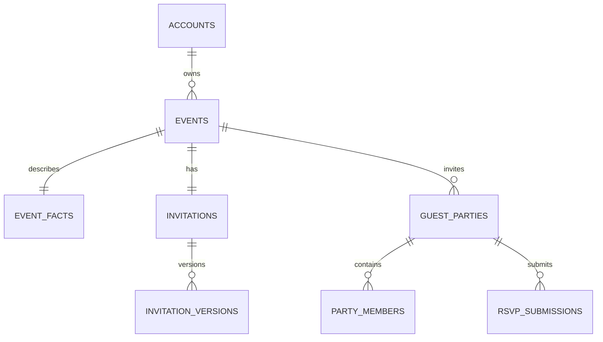
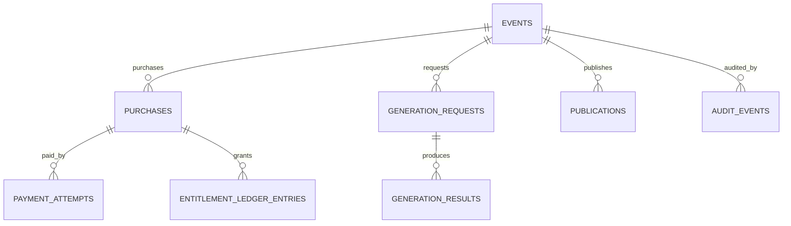

# Database Design

**File:** `docs/06_DATABASE_DESIGN.md`  
**Project:** AI Digital Invitation Platform  
**Status:** Approved — Owner Approved  
**Version:** 1.1  
**Approved date:** 2026-08-17 (package-code enum reconciled 2026-08-25 per `DEC-025`)  
**Depends on:** `docs/00_CLAUDE_RULES.md` through `docs/05_SYSTEM_ARCHITECTURE.md`; `project/DECISIONS.md` (DEC-025)

---

## 1. Purpose

This document defines the logical PostgreSQL database design for the MVP. It translates the approved product, business, domain, and system-architecture decisions into tables, relationships, constraints, transaction boundaries, indexes, retention rules, and migration rules.

It does not select a database hosting provider. It also does not finalize authentication, payment, AI, storage, or queue providers; those choices belong in their dedicated architecture documents.

---

## 2. Design goals

The database must:

1. preserve factual event data independently from AI-generated content;
2. support a global product while launching first in Mauritius;
3. enforce one owner per event and one primary invitation per event;
4. retain immutable invitation, pricing, purchase, entitlement, payment, publication, and RSVP history;
5. make payment and entitlement operations idempotent and auditable;
6. allow guests to RSVP without creating accounts;
7. expose only a deliberately restricted public invitation projection;
8. minimize stored personal data;
9. support safe migrations and operational recovery;
10. remain portable across managed PostgreSQL providers.

---

## 3. Approved technology baseline

- **Authoritative database:** PostgreSQL.
- **Application language:** TypeScript.
- **Architecture:** modular monolith with a web process and a separate durable worker.
- **Schema ownership:** version-controlled application repository.
- **Provider policy:** ordinary PostgreSQL features first; hosting-specific extensions require an approved decision.
- **Exact versions:** rechecked and pinned at implementation start.

PostgreSQL 18 is the current major release at the time of this draft. The application must not assume that the selected managed host already supports it; the deployment document will select a supported major version and define upgrades.

---

## 4. Data-access recommendation

Use **Drizzle ORM with Drizzle Kit**, on a stable release pinned at implementation time, as the default proposal.

Reasons:

- it fits the approved TypeScript stack;
- its schema definitions remain close to PostgreSQL and SQL;
- it supports explicit transactions and generated SQL migrations;
- generated SQL can be reviewed, amended, and committed;
- it does not prevent carefully reviewed raw SQL for partial indexes, triggers, views, locking, or advanced constraints.

Rules:

1. PostgreSQL constraints—not TypeScript types alone—protect database invariants.
2. Generated migrations must be reviewed before application.
3. `push` or equivalent direct schema synchronization is forbidden in staging and production.
4. Beta or release-candidate ORM APIs are forbidden unless separately approved.
5. Repositories may use SQL where it is clearer or safer than ORM abstractions.
6. Domain services must not expose ORM records as domain objects.

Prisma remains a viable fallback if an implementation spike shows a material Drizzle limitation. Switching requires a recorded architecture decision; using both ORMs is prohibited.

---

## 5. Naming and schema conventions

- Table and column names use `snake_case`.
- Application code may map them to TypeScript naming conventions.
- Table names use plural nouns.
- Primary keys use `id`.
- Foreign keys use `<entity>_id`.
- Timestamps use `timestamptz` and are stored in UTC.
- Calendar dates that have no time use `date`.
- Human-entered local event times must also retain an IANA timezone identifier.
- Currency codes use uppercase ISO 4217 strings such as `MUR`, `EUR`, `USD`, or `GBP`.
- Country codes use ISO 3166-1 alpha-2 strings when required.
- Locale tags use normalized BCP 47 strings such as `en`, `fr`, `mfe`, or `ru`.
- All mutable business tables contain `created_at` and `updated_at`.
- Database-generated timestamps are preferred over client timestamps.

---

## 6. Identifier strategy

### 6.1 Internal identifiers

Use database-generated UUIDv7 identifiers when the selected PostgreSQL version supports the required generation function. Otherwise generate UUIDv7 in the trusted application layer with a vetted library. UUIDv4 is the approved fallback.

Internal UUIDs:

- are primary and foreign keys;
- may appear in authenticated internal application traffic;
- must not be used as proof of authorization;
- must not be used as the public invitation URL.

### 6.2 Public invitation identifiers

Each invitation receives a separate `public_slug` generated from at least 128 bits of cryptographically secure randomness and encoded in a URL-safe form.

- It is unique and non-sequential.
- It contains no name, email, event type, date, or internal identifier.
- It may be rotated without changing the invitation's internal ID.
- Knowing it grants access only to the intentionally public invitation projection.

### 6.3 Guest response-management tokens

Guest management links use a separate random token. Only a keyed hash or one-way hash of the token is stored. The plaintext token is shown only when the link is created or sent.

The stored record includes expiry, revocation time, last-used time, and token version. Tokens never serve as host or administrator authentication.

---

## 7. Core relationship map

The diagrams are conceptual. Exact keys and constraints below are authoritative.

---

## 8. Identity and ownership tables

### 8.1 `accounts`

Represents the platform account independently from any future authentication provider.

Key columns:

- `id uuid primary key`
- `auth_subject text unique not null`
- `email_normalized text unique not null`
- `status text not null`
- `role text not null default 'USER'`
- `suspended_at timestamptz null`
- `scheduled_deletion_at timestamptz null`
- `created_at timestamptz not null`
- `updated_at timestamptz not null`

Allowed roles for MVP: `USER`, `SUPPORT`, `ADMIN`. Event-planner classification is profile information, not a privileged role.

Allowed statuses: `ACTIVE`, `SUSPENDED`, `DELETION_PENDING`, `CLOSED`.

`auth_subject` is the stable external authentication identity. Authentication secrets, passwords, recovery codes, and provider tokens must not be stored here.

### 8.2 `profiles`

- `account_id uuid primary key references accounts(id)`
- `display_name text null`
- `organizer_type text not null`
- `preferred_locale text not null default 'en'`
- `country_code char(2) null`
- `timezone text null`
- `created_at timestamptz not null`
- `updated_at timestamptz not null`

Allowed organizer types: `INDIVIDUAL`, `EVENT_PLANNER`, `OTHER`.

### 8.3 `planner_client_references`

Optional private organizer metadata for event planners.

- `id uuid primary key`
- `event_id uuid unique not null references events(id)`
- `client_reference text null`
- `private_notes text null`
- timestamps

This data is never included in a public projection or sent to an AI provider unless explicitly required and approved.

---

## 9. Event tables

### 9.1 `events`

- `id uuid primary key`
- `owner_account_id uuid not null references accounts(id)`
- `event_type text not null default 'WEDDING'`
- `status text not null default 'DRAFT'`
- `selected_package_definition_id uuid null`
- `selected_price_book_entry_id uuid null`
- `archived_at timestamptz null`
- `suspended_at timestamptz null`
- `created_at timestamptz not null`
- `updated_at timestamptz not null`

MVP permits only `WEDDING` through product validation even though the schema can accept future event types through a controlled reference value.

The event lifecycle values approved in the domain model are retained. Transitions occur through domain services; arbitrary status updates are prohibited.

### 9.2 `event_facts`

The authoritative factual source for invitation rendering.

- `event_id uuid primary key references events(id)`
- `host_names text not null`
- `event_date date not null`
- `start_local_time time null`
- `end_local_time time null`
- `timezone text not null`
- `venue_name text not null`
- `venue_address text null`
- `venue_map_url text null`
- `rsvp_deadline date null`
- `contact_name text null`
- `contact_phone text null`
- `contact_email text null`
- `dress_code text null`
- `additional_factual_details text null`
- timestamps

Rules:

- AI-generated copy cannot write to this table.
- The database stores local civil time and timezone rather than converting event meaning into UTC only.
- Date/time validation occurs in the domain layer and is reinforced with appropriate check constraints.
- URLs and contact fields are validated before persistence.

### 9.3 `creative_briefs`

- `event_id uuid primary key references events(id)`
- `religious_cultural_context text null`
- `venue_vibe text null`
- `colour_mood text null`
- `estimated_guest_count integer null`
- `special_elements text null`
- `primary_locale text not null default 'en'`
- `secondary_locales text[] not null default '{}'`
- `additional_notes text null`
- `brief_schema_version integer not null`
- timestamps

Free text has explicit application limits. Structured answers must not be hidden inside a single unbounded JSON object.

---

## 10. Catalogue, pricing, and purchase snapshots

### 10.1 `package_definitions`

Versioned definitions for `BRONZE`, `SILVER`, `GOLD`, and `PLATINUM` (`project/DECISIONS.md` `DEC-025`).

- `id uuid primary key`
- `package_code text not null`
- `version integer not null`
- `status text not null`
- `effective_from timestamptz not null`
- `effective_until timestamptz null`
- timestamps
- unique (`package_code`, `version`)

Existing versions are never edited after a purchase references them. Corrections create a new version.

### 10.2 `entitlement_definitions`

- `id uuid primary key`
- `package_definition_id uuid not null references package_definitions(id)`
- `entitlement_code text not null`
- `quantity integer null`
- `unit text not null`
- `policy_value jsonb null`
- unique (`package_definition_id`, `entitlement_code`)

`policy_value` is permitted only for bounded, schema-validated settings that cannot be represented by a simple quantity. No package may define unlimited or unmetered AI use.

### 10.3 `price_book_entries`

- `id uuid primary key`
- `package_definition_id uuid not null references package_definitions(id)`
- `market_code text not null`
- `currency_code char(3) not null`
- `amount_minor bigint not null`
- `tax_policy_code text null`
- `effective_from timestamptz not null`
- `effective_until timestamptz null`
- `status text not null`
- timestamps

Money is stored as integer minor units, never floating point. This is safer for exact payment comparisons and supports currencies with different minor-unit rules through a currency metadata table or application library.

Overlapping active price intervals for the same package, market, and currency are prohibited.

### 10.4 `purchases`

An immutable commercial snapshot created server-side before checkout.

- `id uuid primary key`
- `event_id uuid not null references events(id)`
- `account_id uuid not null references accounts(id)`
- `package_definition_id uuid not null references package_definitions(id)`
- `price_book_entry_id uuid not null references price_book_entries(id)`
- `package_code_snapshot text not null`
- `package_version_snapshot integer not null`
- `currency_code char(3) not null`
- `subtotal_minor bigint not null`
- `tax_minor bigint not null default 0`
- `total_minor bigint not null`
- `status text not null`
- `checkout_expires_at timestamptz null`
- timestamps

Allowed statuses: `CREATED`, `PAYMENT_PENDING`, `PAID`, `CANCELLED`, `EXPIRED`, `REFUNDED`, `PARTIALLY_REFUNDED`, `DISPUTED`.

The server derives all amounts. Client-supplied totals are never authoritative.

### 10.5 `purchase_entitlement_snapshots`

Captures exactly what was sold even if package definitions later change.

- `id uuid primary key`
- `purchase_id uuid not null references purchases(id)`
- `entitlement_code text not null`
- `quantity integer null`
- `unit text not null`
- `policy_value jsonb null`
- unique (`purchase_id`, `entitlement_code`)

---

## 11. Payment tables

### 11.1 `payment_attempts`

- `id uuid primary key`
- `purchase_id uuid not null references purchases(id)`
- `provider_code text not null`
- `provider_attempt_id text null`
- `idempotency_key text not null`
- `status text not null`
- `currency_code char(3) not null`
- `expected_amount_minor bigint not null`
- `failure_code text null`
- `failure_message_safe text null`
- timestamps
- unique (`provider_code`, `provider_attempt_id`) where provider ID is not null
- unique (`provider_code`, `idempotency_key`)

### 11.2 `payment_events`

Inbox for provider webhook deduplication and forensic traceability.

- `id uuid primary key`
- `provider_code text not null`
- `provider_event_id text not null`
- `event_type text not null`
- `signature_verified boolean not null`
- `received_at timestamptz not null`
- `processed_at timestamptz null`
- `processing_status text not null`
- `payload_redacted jsonb null`
- `payload_digest text not null`
- `failure_reason text null`
- unique (`provider_code`, `provider_event_id`)

Raw webhook bodies may be retained only if the Payment Architecture and Security Architecture approve encryption and retention. The default is a minimized, redacted payload plus a digest.

### 11.3 `payment_transactions`

Records verified financial movements rather than mutable checkout attempts.

- `id uuid primary key`
- `purchase_id uuid not null references purchases(id)`
- `payment_attempt_id uuid null references payment_attempts(id)`
- `provider_code text not null`
- `provider_transaction_id text not null`
- `transaction_type text not null`
- `currency_code char(3) not null`
- `amount_minor bigint not null`
- `verified_at timestamptz not null`
- `provider_occurred_at timestamptz null`
- `metadata_redacted jsonb null`
- `created_at timestamptz not null`
- unique (`provider_code`, `provider_transaction_id`, `transaction_type`)

Transaction types include `CAPTURE`, `REFUND`, `PARTIAL_REFUND`, `CHARGEBACK`, and `REVERSAL`.

### 11.4 Payment truth rule

Redirects and client callbacks may update user-facing progress but cannot create a successful financial transaction. Only server-side provider verification can:

1. insert a verified `CAPTURE` transaction;
2. mark the purchase paid;
3. grant purchased entitlements;
4. make the event eligible for publication.

Those changes occur in one database transaction and use the provider event/transaction IDs as idempotency boundaries.

---

## 12. Entitlement accounting

### 12.1 `entitlement_ledger_entries`

The ledger is append-only and authoritative.

- `id uuid primary key`
- `event_id uuid not null references events(id)`
- `purchase_id uuid null references purchases(id)`
- `entitlement_code text not null`
- `entry_type text not null`
- `quantity_delta integer not null`
- `generation_request_id uuid null`
- `idempotency_key text not null`
- `reason_code text not null`
- `reason_note text null`
- `created_by_account_id uuid null references accounts(id)`
- `created_at timestamptz not null`
- unique (`event_id`, `entitlement_code`, `idempotency_key`)

Entry types: `GRANT`, `RESERVE`, `CONSUME`, `RELEASE`, `ADJUST`, `REVOKE`, `EXPIRE`.

No ledger row is updated or deleted. Corrections use compensating entries.

### 12.2 `entitlement_balances`

Optional transactionally maintained projection for efficient reads.

- `event_id uuid not null`
- `entitlement_code text not null`
- `granted integer not null`
- `reserved integer not null`
- `consumed integer not null`
- `adjusted integer not null`
- `updated_at timestamptz not null`
- primary key (`event_id`, `entitlement_code`)

It must be fully reconstructable from the ledger. A reconciliation job compares the projection with ledger-derived balances.

### 12.3 Atomic reservation rule

Creating a generation request must lock the relevant balance row, verify availability, append a `RESERVE` entry, update the balance projection, and create the request in one transaction.

Success converts the reservation to consumption. A final failure or cancellation releases it. Retry attempts inside the same logical generation request do not consume additional entitlements unless the approved package rule explicitly says otherwise.

---

## 13. AI generation tables

### 13.1 `generation_requests`

- `id uuid primary key`
- `event_id uuid not null references events(id)`
- `request_kind text not null`
- `status text not null`
- `idempotency_key text not null`
- `brief_snapshot jsonb not null`
- `event_facts_digest text not null`
- `prompt_template_version text not null`
- `requested_by_account_id uuid not null references accounts(id)`
- `queued_at timestamptz null`
- `started_at timestamptz null`
- `completed_at timestamptz null`
- `final_failure_code text null`
- timestamps
- unique (`event_id`, `idempotency_key`)

The snapshot is schema-versioned and immutable. It must not contain secrets or unnecessary guest personal data.

### 13.2 `generation_attempts`

- `id uuid primary key`
- `generation_request_id uuid not null references generation_requests(id)`
- `attempt_number integer not null`
- `provider_code text not null`
- `model_identifier text not null`
- `provider_request_id text null`
- `status text not null`
- `started_at timestamptz not null`
- `completed_at timestamptz null`
- `error_class text null`
- `usage_input_units bigint null`
- `usage_output_units bigint null`
- `estimated_cost_minor bigint null`
- `cost_currency_code char(3) null`
- `response_metadata_redacted jsonb null`
- unique (`generation_request_id`, `attempt_number`)
- unique (`provider_code`, `provider_request_id`) where provider ID is not null

### 13.3 `generation_results`

- `id uuid primary key`
- `generation_request_id uuid not null references generation_requests(id)`
- `result_number integer not null`
- `result_type text not null`
- `validated_content jsonb not null`
- `validation_schema_version integer not null`
- `moderation_status text not null`
- `created_at timestamptz not null`
- unique (`generation_request_id`, `result_number`, `result_type`)

Only schema-validated output enters `validated_content`. Event facts are rendered from `event_facts`, not trusted from AI output.

### 13.4 `generated_assets`

- `id uuid primary key`
- `generation_result_id uuid not null references generation_results(id)`
- `storage_provider_code text not null`
- `storage_object_key text not null`
- `media_type text not null`
- `byte_size bigint not null`
- `width integer null`
- `height integer null`
- `content_digest text not null`
- `moderation_status text not null`
- `deleted_at timestamptz null`
- timestamps
- unique (`storage_provider_code`, `storage_object_key`)

The database stores object metadata, never the generated binary itself.

---

## 14. Invitation and publication tables

### 14.1 `invitations`

- `id uuid primary key`
- `event_id uuid unique not null references events(id)`
- `public_slug text unique not null`
- `current_version_id uuid null`
- `created_at timestamptz not null`
- `updated_at timestamptz not null`

The unique event foreign key enforces one primary invitation per event.

### 14.2 `invitation_versions`

- `id uuid primary key`
- `invitation_id uuid not null references invitations(id)`
- `version_number integer not null`
- `design_config jsonb not null`
- `copy_config jsonb not null`
- `source_generation_result_id uuid null references generation_results(id)`
- `validation_status text not null`
- `validation_errors jsonb null`
- `created_by_account_id uuid not null references accounts(id)`
- `created_at timestamptz not null`
- unique (`invitation_id`, `version_number`)

Versions are immutable. Editing creates a new version. `current_version_id` must refer to a version belonging to the same invitation; this invariant is enforced transactionally and, where practical, by a composite foreign key.

### 14.3 `publications`

- `id uuid primary key`
- `event_id uuid not null references events(id)`
- `invitation_version_id uuid not null references invitation_versions(id)`
- `status text not null`
- `published_at timestamptz null`
- `expires_at timestamptz null`
- `ended_at timestamptz null`
- `ended_reason text null`
- `created_at timestamptz not null`
- `updated_at timestamptz not null`

A partial unique index allows only one active publication per event.

The first successful publication establishes the hosting start date. Later edits or republishes do not reset it unless an explicit entitlement grants an extension.

### 14.4 Public invitation projection

Public reads use a deliberately defined query/view returning only:

- public slug;
- current published invitation version;
- approved display fields from event facts;
- validated invitation copy and design configuration;
- public asset references;
- RSVP-open/closed status and deadline;
- minimum metadata required for rendering and sharing.

It excludes account IDs, internal event IDs, payment data, package internals, guest lists, planner notes, moderation details, provider metadata, audit events, and unpublished versions.

Application authorization remains mandatory even if database row-level security is later added as defense in depth.

---

## 15. Guest and RSVP tables

### 15.1 `guest_parties`

The invitation unit and primary RSVP unit.

- `id uuid primary key`
- `event_id uuid not null references events(id)`
- `display_name text not null`
- `contact_phone text null`
- `contact_email text null`
- `maximum_attendees integer not null default 1`
- `source text not null`
- `host_notes text null`
- `archived_at timestamptz null`
- timestamps

At least one contact method may be required only when the host wants direct sending or response-management delivery. Public RSVP must not force an account or marketing consent.

### 15.2 `party_members`

- `id uuid primary key`
- `guest_party_id uuid not null references guest_parties(id)`
- `display_name text not null`
- `member_order integer not null`
- `created_at timestamptz not null`
- `updated_at timestamptz not null`
- unique (`guest_party_id`, `member_order`)

Members are optional. Guest-count entitlements apply to party capacity/attendance according to the later `product/GUEST_RULES.md`, not merely the number of member rows.

### 15.3 `rsvp_submissions`

Each submit action is immutable.

- `id uuid primary key`
- `guest_party_id uuid not null references guest_parties(id)`
- `revision_number integer not null`
- `attendance_status text not null`
- `attendee_count integer not null`
- `guest_message text null`
- `submitted_at timestamptz not null`
- `supersedes_submission_id uuid null references rsvp_submissions(id)`
- `submission_source text not null`
- `ip_digest text null`
- `user_agent_class text null`
- unique (`guest_party_id`, `revision_number`)

Rules:

- `attendance_status` is `ATTENDING` or `NOT_ATTENDING`.
- `NOT_ATTENDING` requires `attendee_count = 0`.
- `ATTENDING` requires a positive count not exceeding the party maximum.
- Only the newest valid revision is current; previous submissions remain historical.
- Raw IP addresses are not retained by default. A short-lived or keyed digest may support abuse prevention if approved in the Security Architecture.

### 15.4 `response_management_tokens`

- `id uuid primary key`
- `guest_party_id uuid not null references guest_parties(id)`
- `token_hash text unique not null`
- `token_version integer not null`
- `expires_at timestamptz not null`
- `revoked_at timestamptz null`
- `last_used_at timestamptz null`
- `created_at timestamptz not null`

Multiple historical tokens may exist, but only one active token is allowed per party through a partial unique index.

### 15.5 CSV import tracking

Use `guest_imports` and `guest_import_rows` to make imports reviewable and idempotent.

`guest_imports` records event, uploader, file digest, status, row counts, and timestamps. `guest_import_rows` records row number, normalized candidate data, validation outcome, and the resulting guest party ID. The original CSV is temporary and is deleted after the defined short retention period.

---

## 16. Operational reliability tables

### 16.1 `outbox_events`

Implements the transactional outbox for critical work.

- `id uuid primary key`
- `aggregate_type text not null`
- `aggregate_id uuid not null`
- `event_type text not null`
- `payload jsonb not null`
- `payload_schema_version integer not null`
- `occurred_at timestamptz not null`
- `available_at timestamptz not null`
- `claimed_at timestamptz null`
- `processed_at timestamptz null`
- `attempt_count integer not null default 0`
- `last_error_safe text null`
- `deduplication_key text unique not null`

The domain change and its outbox event are inserted in the same transaction. Workers claim rows safely and handlers remain idempotent.

### 16.2 `job_executions`

Tracks execution history without making the database itself the permanent queue provider contract.

- `id uuid primary key`
- `outbox_event_id uuid null references outbox_events(id)`
- `job_type text not null`
- `queue_job_id text null`
- `status text not null`
- `attempt_number integer not null`
- `started_at timestamptz null`
- `completed_at timestamptz null`
- `error_class text null`
- `created_at timestamptz not null`

Provider-specific queue payloads are not authoritative business records.

### 16.3 `audit_events`

Append-only record of security-sensitive and business-critical actions.

- `id uuid primary key`
- `actor_type text not null`
- `actor_account_id uuid null references accounts(id)`
- `action text not null`
- `target_type text not null`
- `target_id uuid null`
- `event_id uuid null references events(id)`
- `reason_code text null`
- `reason_note text null`
- `before_snapshot_redacted jsonb null`
- `after_snapshot_redacted jsonb null`
- `request_correlation_id text null`
- `occurred_at timestamptz not null`

The application database role used by normal services receives no `UPDATE` or `DELETE` privilege on this table. Corrections are new events. Audit payloads must be minimized and must never contain secrets, payment credentials, raw management tokens, or unnecessary guest data.

---

## 17. Database-enforced invariants

The database must enforce, where feasible:

1. foreign-key ownership and parent-child integrity;
2. one profile per account;
3. one event-facts row and one creative brief per event;
4. one primary invitation per event;
5. unique invitation version numbers within an invitation;
6. one active publication per event;
7. non-negative prices, taxes, totals, usage, sizes, and capacities;
8. RSVP attendance/count consistency;
9. uniqueness of provider events, provider transactions, and idempotency keys;
10. uniqueness of active response-management tokens;
11. purchase/account ownership consistent with event ownership;
12. currency consistency between purchase, attempt, and verified transaction;
13. immutable ledger, financial transaction, version, RSVP-history, and audit rows;
14. valid hosting interval ordering;
15. valid effective-date intervals for versioned commercial records.

Cross-table or state-transition invariants that cannot be expressed safely as ordinary constraints are enforced by a domain transaction and tested with integration tests. Triggers are reserved for small, stable database invariants—not for hidden business workflows.

---

## 18. Transaction and concurrency boundaries

The following operations require explicit database transactions:

- create event with event facts, creative brief, and invitation shell;
- select package and establish the applicable commercial reference;
- create purchase snapshot;
- process a verified payment event and grant entitlements;
- reserve or release generation entitlement;
- accept generation result and create invitation version;
- switch current invitation version;
- publish, unpublish, expire, suspend, or restore an invitation;
- submit an RSVP revision;
- apply support/admin entitlement adjustment;
- append a critical audit event and outbox event with its business change.

Use row-level locking or atomic conditional updates for entitlement balance, payment processing, publication, and RSVP revision numbering. Transactions must be short and must not include calls to payment, AI, email, object-storage, or other network providers.

Default isolation is PostgreSQL `READ COMMITTED`. Use explicit locks or a stronger isolation level only for the small workflows whose correctness requires it, with retries for serialization/deadlock failures.

---

## 19. Index strategy

Create indexes from verified query patterns, beginning with:

- `events(owner_account_id, updated_at desc)` for the dashboard;
- partial active-event index excluding archived rows;
- unique `invitations(public_slug)`;
- partial unique active publication per event;
- `guest_parties(event_id, display_name)`;
- `rsvp_submissions(guest_party_id, revision_number desc)`;
- `generation_requests(event_id, created_at desc)`;
- `generation_requests(status, created_at)` for recovery/operations;
- `purchases(account_id, created_at desc)`;
- `payment_events(processing_status, received_at)`;
- `entitlement_ledger_entries(event_id, entitlement_code, created_at)`;
- `outbox_events(processed_at, available_at)` with a partial index for unprocessed rows;
- `audit_events(event_id, occurred_at desc)` and `audit_events(actor_account_id, occurred_at desc)`.

Do not index every foreign key or JSON field automatically. Use `EXPLAIN (ANALYZE, BUFFERS)` against representative data before adding specialized indexes. Indexes that materially slow high-write tables require justification.

---

## 20. JSONB policy

JSONB is permitted for:

- immutable, versioned questionnaire/generation snapshots;
- validated invitation design and copy configurations;
- bounded entitlement policy values;
- redacted provider metadata;
- outbox payloads with explicit schema versions;
- minimized audit before/after snapshots.

JSONB is prohibited as a substitute for relational modeling of accounts, events, event facts, purchases, payments, entitlements, guest parties, RSVP submissions, publications, or audit identity.

Every JSONB payload must have:

1. an application validation schema;
2. a schema version where it may evolve;
3. a size limit;
4. a privacy classification;
5. a migration or backward-compatibility strategy.

---

## 21. Security and authorization

- The application uses distinct database roles for migrations, runtime reads/writes, workers, reporting, and emergency administration where supported.
- Production runtime credentials cannot alter schemas.
- Least privilege applies to tables and operations.
- Authorization is enforced in domain/application services for every operation.
- Row-level security may be added as defense in depth after the authentication provider and deployment topology are known; it is not a substitute for application authorization.
- Public rendering queries use a restricted view or repository projection, not unrestricted table access.
- Sensitive columns are never returned by broad `select *` repository methods.
- Secrets and raw authentication/payment credentials are never stored.
- Database connections require encryption in transit outside trusted local development.
- Backups and replicas must receive equivalent access controls and retention treatment.

---

## 22. Privacy, deletion, and retention

Data is classified as:

- **Public invitation data:** explicitly published facts and approved creative content;
- **Account data:** identity and preference data;
- **Guest personal data:** party/member names and contact details;
- **Commercial data:** purchase, payment, refund, and entitlement records;
- **Operational data:** generation metadata, jobs, errors, and provider references;
- **Restricted audit data:** security and administrative history.

Deletion is a workflow, not an uncontrolled cascade.

- Account closure first blocks access and starts a documented deletion/anonymization process.
- Financial and audit records are retained or anonymized according to legal requirements determined in `docs/09_SECURITY_ARCHITECTURE.md`.
- Guest data is eligible for deletion or anonymization after the event/hosting lifecycle and applicable retention window.
- Public invitation assets are removed from public access when expired, unpublished, suspended, or removed; physical deletion follows retention policy.
- Database backups age out according to the approved backup schedule rather than being selectively edited.

Exact Mauritius and international retention periods are intentionally not invented here. They require current legal research and a documented policy before launch.

---

## 23. Migration policy

1. Every schema change uses a timestamped or ordered migration committed to Git.
2. Applied migration history is immutable.
3. Production never uses automatic schema push/synchronization.
4. CI creates a clean database and applies the entire migration history.
5. CI checks migration-history consistency and schema drift.
6. Data migrations are resumable, observable, and idempotent where practical.
7. Destructive changes use expand-and-contract: add, backfill, dual-read/write if necessary, switch, verify, then remove in a later release.
8. Large table rewrites or locks require an execution and rollback plan.
9. Migration deployment is separated from ordinary web startup.
10. A backup/restore checkpoint is confirmed before high-risk production migrations.

---

## 24. Backup and recovery requirements

The selected PostgreSQL host must support:

- automated encrypted backups;
- point-in-time recovery or an explicitly accepted alternative;
- documented recovery-point and recovery-time objectives;
- restoration into an isolated environment;
- periodic restore testing;
- monitoring for failed backups and replication lag where applicable;
- region and data-residency review before launch.

A backup is not considered valid until restoration has been tested. Provider selection and exact RPO/RTO values belong in `docs/12_DEPLOYMENT.md`.

---

## 25. Observability and maintenance

Monitor:

- connection-pool saturation;
- slow queries and lock waits;
- deadlocks and transaction retry rates;
- storage and index growth;
- replication and backup health;
- outbox backlog and oldest unprocessed event;
- failed payment-event processing;
- entitlement reconciliation mismatches;
- orphan-detection queries;
- migration duration and failure.

Application logs use correlation IDs but redact personal data and secrets. Database query logging must not expose bound sensitive values in production.

---

## 26. Test requirements

At minimum, automated database tests must prove:

- all migrations apply from an empty database;
- important constraints reject invalid rows;
- users cannot access another owner's event through repositories/services;
- duplicate payment webhooks do not double-grant entitlements;
- concurrent generation requests cannot overspend entitlements;
- failed generation releases the correct reservation once;
- publication cannot occur without verified payment and a valid invitation version;
- only one active publication exists per event;
- RSVP revisions preserve history and enforce capacity;
- invitation public projection excludes private fields;
- audit and ledger rows cannot be modified by normal runtime roles;
- entitlement projections reconcile to their ledgers;
- timezones, locales, and non-MUR currencies are not blocked by the schema;
- restoration from backup is exercised outside production.

---

## 27. Explicit MVP exclusions

The MVP database does not include:

- multiple event owners or collaborative editing;
- recurring consumer subscriptions;
- a template marketplace;
- referrals or affiliate accounting;
- public API credentials or OAuth clients;
- general-purpose analytics warehouse tables;
- autonomous AI research or training datasets;
- multi-region active-active writes;
- database sharding;
- Kubernetes-specific persistence design;
- arbitrary custom event types exposed to users.

Future features require migrations and new approved documents; unused speculative tables must not be created now.

---

## 28. Deferred details owned by later documents

- `docs/07_AI_ARCHITECTURE.md`: prompt/output retention, model usage and cost fields, provider metadata.
- `docs/08_PAYMENT_ARCHITECTURE.md`: payment provider mapping, signature verification, refunds, disputes, webhook retention.
- `docs/09_SECURITY_ARCHITECTURE.md`: encryption, legal basis, consent, data-subject workflows, retention periods, RLS decision.
- `product/ENTITLEMENTS.md`: exact entitlement codes and consumption semantics.
- `product/GUEST_RULES.md`: precise guest-capacity and RSVP amendment rules.
- `product/LOCALIZATION.md`: final locale fallback and translation storage rules.
- `docs/12_DEPLOYMENT.md`: managed PostgreSQL provider, supported major version, connection pool, backup targets, RPO/RTO.

---

## 29. Current-source notes

The following official documentation informed this draft and must be rechecked at implementation:

- PostgreSQL 18 is the current documented major release: <https://www.postgresql.org/docs/current/release-18.html>
- PostgreSQL table constraints: <https://www.postgresql.org/docs/current/sql-createtable.html>
- Drizzle migration approaches and SQL generation: <https://orm.drizzle.team/docs/migrations>
- Drizzle transaction support: <https://orm.drizzle.team/docs/transactions>
- Drizzle migration-history consistency checking: <https://orm.drizzle.team/docs/drizzle-kit-check>
- Prisma Migrate remains the evaluated fallback: <https://www.prisma.io/docs/orm/prisma-migrate>

These sources establish capabilities, not approval of a hosting provider or an unpinned package version.

---

## 30. Approved owner decisions

### Decision 1 — Data access

**Proposal:** Use Drizzle ORM and Drizzle Kit on a pinned stable release, with reviewed SQL migrations and raw SQL permitted when necessary. Keep Prisma as an evaluated fallback only; never use both.

### Decision 2 — Internal IDs

**Proposal:** Use UUIDv7 internally when supported by the selected PostgreSQL/runtime baseline, with vetted application generation and UUIDv4 as fallback. Use a separate random public slug for invitation URLs.

### Decision 3 — Money

**Proposal:** Store all money as integer minor units plus an ISO currency code. Never use floating point and never assume MUR globally.

### Decision 4 — Entitlements

**Proposal:** Use an append-only entitlement ledger as the source of truth plus a reconstructable balance projection for efficient enforcement.

### Decision 5 — Invitation edits

**Proposal:** Make invitation versions immutable. Every meaningful edit creates a new version; the invitation points to the current one.

### Decision 6 — RSVP history

**Proposal:** Preserve each RSVP submission as an immutable revision instead of overwriting the prior response.

### Decision 7 — Guest tokens

**Proposal:** Store only hashes of guest response-management tokens, support expiry/revocation, and permit only one active token per guest party.

### Decision 8 — Public reads

**Proposal:** Serve invitations from a strict server-controlled public projection. Consider PostgreSQL RLS later as defense in depth after authentication and hosting are selected.

### Decision 9 — Webhook retention

**Proposal:** Store redacted payment-event payloads and cryptographic digests by default, not raw bodies. Allow encrypted raw retention only if the payment/security documents prove it necessary.

### Decision 10 — Soft deletion

**Proposal:** Use lifecycle status plus targeted archival/anonymization rather than a universal `deleted_at` column and uncontrolled cascade deletion.

### Decision 11 — Database triggers

**Proposal:** Use constraints and explicit domain transactions first. Restrict triggers to narrow, stable invariants such as immutability protection; never hide broad business workflows in triggers.

### Decision 12 — Hosting provider

**Proposal:** Keep the PostgreSQL hosting provider undecided until Deployment Architecture. Require ordinary PostgreSQL compatibility, encrypted backups, tested restoration, and point-in-time recovery.

---

## 31. Approval record

**Status:** Approved — Owner Approved.  
**Approved version:** 1.1.  
**Approved date:** 2026-08-17 (package-code enum reconciled 2026-08-25 per `DEC-025`).  
**Owner decisions:** Decisions 1–12 approved as proposed.
