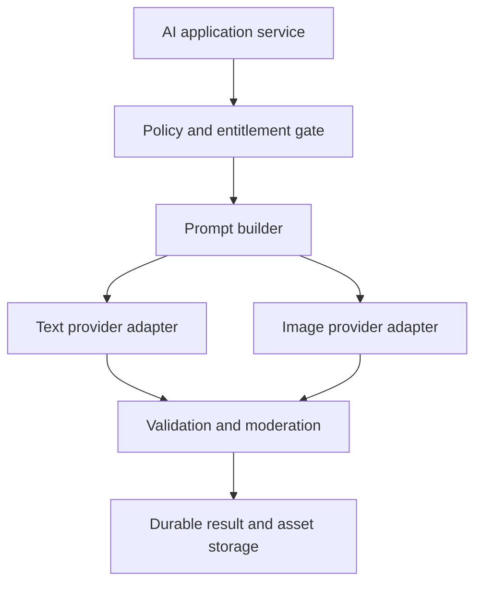
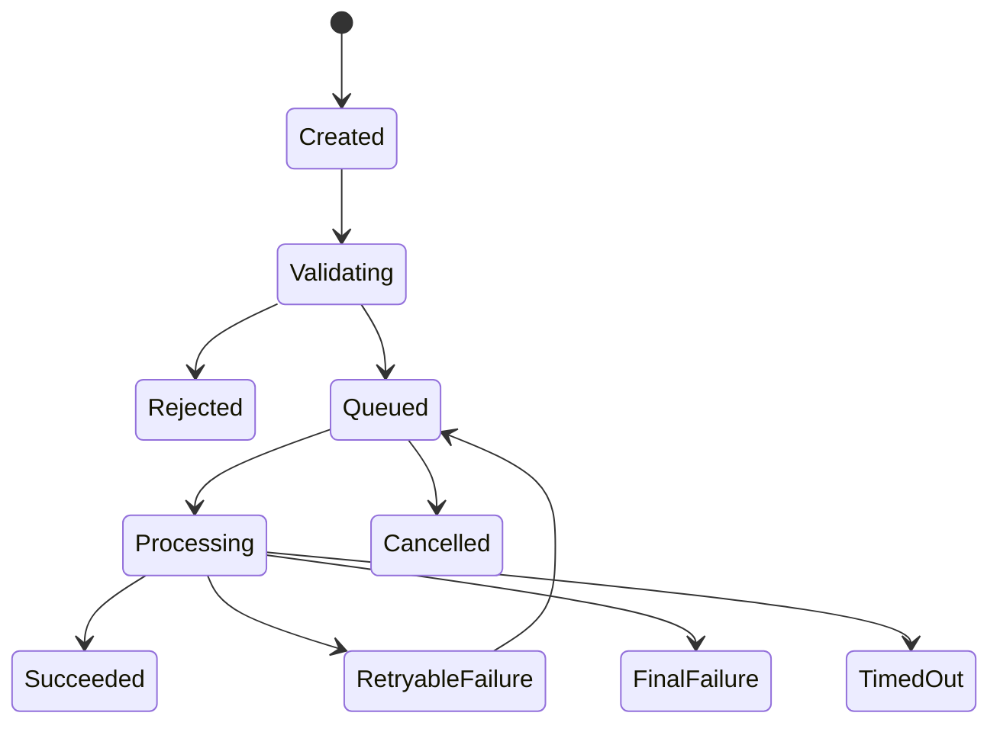

# AI Architecture

**File:** `docs/07_AI_ARCHITECTURE.md`  
**Project:** AI Digital Invitation Platform  
**Status:** Approved — Owner Approved  
**Version:** 1.0  
**Approved date:** 2026-08-17  
**Depends on:** `docs/00_CLAUDE_RULES.md` through `docs/06_DATABASE_DESIGN.md`

---

## 1. Purpose

This document defines how the MVP uses generative AI to create invitation copy, visual concepts, and controlled design revisions without allowing an AI provider to control factual event data, pricing, entitlements, publication, or security decisions.

The goal is not to add AI everywhere. AI is used only where it creates clear customer value: producing original creative concepts quickly and helping the owner make bounded refinements.

---

## 2. Architectural position

AI is an external, probabilistic subsystem. It is never the system of record.

The application owns:

- event facts;
- package and entitlement rules;
- prompts and validation schemas;
- generation state and idempotency;
- moderation decisions and escalation policy;
- durable copies of accepted outputs;
- provider selection and failover;
- usage and cost accounting.

Providers receive only the minimum data required for a specific request. Provider URLs, IDs, and responses are temporary integration artifacts, not authoritative product records.

---

## 3. MVP AI scope

### Included

1. Generate structured invitation copy.
2. Generate text-free visual backgrounds or artwork.
3. Produce the number of initial concepts allowed by the selected package.
4. Perform bounded copy/style adjustments through the Vibe Tuner.
5. Regenerate imagery only when an approved adjustment actually requires it.
6. Validate, moderate, meter, log, and recover every generation request.
7. Support English first, French second, and Mauritian Kreol where enabled for Mauritian customers.

### Deferred

- Russian generation as a launch promise;
- AI-generated music or video;
- unrestricted conversational design agents;
- per-guest personalized AI messages;
- user-trained models or LoRAs;
- face cloning or identity replication;
- autonomous web research;
- automatic cultural/religious classification from names or images;
- AI decisions about payments, refunds, access, publication, or guest eligibility;
- claims of unlimited AI usage.

Russian remains part of the long-term global localization direction, but it is not an MVP AI entitlement.

---

## 4. Provider architecture



Provider SDKs are confined to infrastructure adapters. Domain and application modules depend on internal interfaces and normalized errors.

### 4.1 Text provider contract

```ts
interface TextGenerationProvider {
  generateInvitationCopy(input: TextGenerationInput): Promise<TextGenerationOutput>;
  reviseInvitationCopy(input: CopyRevisionInput): Promise<TextGenerationOutput>;
  healthCheck(): Promise<ProviderHealth>;
}
```

The normalized output includes provider code, exact model identifier, provider request ID, usage, latency, finish reason, and validated structured content.

### 4.2 Image provider contract

```ts
interface ImageGenerationProvider {
  createBackground(input: ImageGenerationInput): Promise<ImageJobReference>;
  getJob(job: ImageJobReference): Promise<ImageJobStatus>;
  cancelJob(job: ImageJobReference): Promise<void>;
}
```

The contract supports asynchronous completion, timeouts, cancellation, webhook/poll normalization, explicit dimensions, format, safety status, and provider/model version.

### 4.3 Moderation contract

```ts
interface ContentSafetyProvider {
  assessText(input: SafetyTextInput): Promise<SafetyAssessment>;
  assessImage(input: SafetyImageInput): Promise<SafetyAssessment>;
}
```

Safety checks may use provider-native protections plus a separate moderation service. Provider acceptance alone is not proof that content satisfies platform policy.

---

## 5. Initial provider proposal

### 5.1 Text generation

Use the **OpenAI Responses API** as the initial text-generation integration, using a pinned model snapshot that passes the project evaluation suite at implementation time.

Reasons:

- structured, schema-constrained outputs fit the invitation-copy contract;
- one maintained TypeScript integration can support generation and moderation-adjacent workflows;
- explicit API data controls are documented;
- model choice can remain configuration rather than domain logic.

Anthropic remains the first fallback candidate and must be supported by the abstraction, but an Anthropic adapter is implemented for MVP only if benchmark results, commercial continuity, or failover requirements justify the extra operational work.

The original assumption that Claude must be the production copy provider is therefore not locked. Claude Code is the development agent; that does not require the product itself to use Anthropic.

### 5.2 Image generation

Use **Replicate official models** as the initial image-generation integration, with the exact approved model selected through a pre-launch benchmark and pinned in configuration.

Reasons:

- a single API exposes multiple commercial image models;
- official model pages document pricing and usage/privacy properties;
- asynchronous prediction lifecycle, webhooks, cancellation, and model versioning fit the worker architecture;
- changing the model does not require changing the application/domain contract.

Only official or explicitly approved commercial models may be used. Community models are disabled by default. The benchmark must confirm quality, licensing, commercial-use rights, latency, cost, data handling, and cultural prompt performance.

OpenAI image generation is the primary fallback candidate. It may replace Replicate if the benchmark shows materially better quality, privacy, reliability, or total cost.

### 5.3 No automatic cross-provider failover

The MVP must not silently resend customer content to a different provider after failure. Automatic cross-provider failover creates privacy, licensing, output-consistency, and cost problems.

Failover requires:

- an approved provider and model;
- equivalent safety/data-processing review;
- explicit routing configuration;
- auditability;
- either prior disclosure in the privacy notice or a retry initiated under the approved policy.

Retries on the same provider/model may occur automatically under the bounded retry policy.

---

## 6. Model selection and pinning

Model names change faster than this architecture. Therefore:

1. No floating aliases such as `latest` are permitted in production.
2. Store the exact provider and model/version identifier with every attempt.
3. Promote a model only after evaluation in staging.
4. Treat model changes as controlled releases, not configuration accidents.
5. Retain the prior approved configuration for rollback where the provider supports it.
6. Recheck pricing, regional availability, terms, retention, and deprecation notices before promotion.

The initial benchmark evaluates at least two text candidates and three image candidates using the same test corpus.

---

## 7. Canonical AI inputs

The application constructs a provider-neutral input from approved database records.

### Text input

- event type;
- authoritative display facts required in copy;
- selected cultural/religious context supplied by the owner;
- venue vibe and colour mood;
- special elements;
- target locale(s);
- package-specific tone/copy capabilities;
- bounded owner notes;
- prompt template version.

### Image input

- desired visual theme and mood;
- approved cultural motifs;
- colour palette;
- composition and reserved text-space instructions;
- aspect ratio and technical output requirements;
- negative constraints, including no embedded event text by default;
- prompt template and safety-policy version.

Guest lists, payment data, private planner notes, authentication identifiers, and unrelated personal data must never be sent.

---

## 8. Event-fact firewall

AI must not become the authority for names, dates, times, addresses, contact details, or RSVP deadlines.

The copy result may contain creative prose and labeled placeholders, but the final renderer inserts factual fields from `event_facts`. If factual text is allowed inside a generated copy field, it must be compared against the authoritative values and rejected on mismatch.

The system must never silently “correct,” infer, translate, or embellish a factual value. Missing facts cause validation failure or a user prompt—not invention.

---

## 9. Structured text output

The normalized result schema is versioned and contains no HTML:

```ts
type InvitationCopyV1 = {
  schemaVersion: 1;
  primaryLocale: string;
  title: string;
  subtitle?: string;
  body: string;
  footer?: string;
  localized: Array<{
    locale: string;
    title: string;
    subtitle?: string;
    body: string;
    footer?: string;
  }>;
  culturalNotesUsed: string[];
};
```

Validation includes:

- strict schema parsing and rejection of unknown fields;
- length and Unicode limits;
- locale allow-list;
- factual consistency checks;
- HTML/script/URL rejection where prohibited;
- safety screening;
- duplication and placeholder checks;
- no claims that are not supported by owner input;
- no provider prose outside the required object.

Invalid responses may receive one bounded repair attempt. Repair consumes operational provider budget but does not consume another customer entitlement because it belongs to the same logical generation request.

---

## 10. Image generation rules

MVP image generation creates visual artwork/backgrounds, not the complete invitation containing AI-rendered names and dates.

Rules:

1. The default image is text-free.
2. Factual invitation text is rendered by the application for accuracy and accessibility.
3. Output must reserve usable composition space for text.
4. Dimensions and aspect ratios are explicit and package-controlled.
5. Provider output is copied promptly into platform-controlled object storage.
6. Temporary provider URLs are never published directly.
7. File signatures, dimensions, byte size, and media type are verified before storage.
8. Metadata is stripped or normalized where appropriate.
9. A content digest detects duplicate/corrupt transfers.
10. Source and derivative asset lineage is recorded.

“4K,” where later offered, must mean a documented pixel dimension and may be achieved through a controlled upscale pipeline. It must not be promised merely because a package has a premium label.

---

## 11. Prompt architecture

Prompts are code-controlled, versioned templates composed from:

1. system policy;
2. output schema and formatting instructions;
3. product creative rules;
4. cultural-sensitivity rules;
5. package entitlements;
6. normalized user input;
7. explicit negative constraints.

Prompt templates live in source control. Each production request records the template version, not secrets or the entire system prompt unless an approved encrypted audit need exists.

User text is wrapped as untrusted data. It must not be concatenated into privileged instructions. Instructions inside user notes such as “ignore all rules” have no authority.

---

## 12. Cultural and religious safety

The product may use only cultural/religious context explicitly selected or written by the owner. It must not infer religion, ethnicity, caste, race, nationality, or sexuality from names, photos, venue, language, or location.

Prompt and evaluation rules must detect or discourage:

- mixed or incorrect sacred symbols;
- placement of sacred content in disrespectful contexts;
- stereotypes and caricatures;
- fabricated quotations or scripture;
- sexualized treatment of religious/cultural clothing;
- political or extremist symbolism;
- assumptions that all Mauritian weddings share one tradition.

The interface must make motifs optional. When confidence is low, generate a neutral elegant design rather than inventing cultural details.

AI output is inspiration, not a guarantee of religious or cultural correctness. Owners review and approve before publication.

---

## 13. Moderation and prohibited requests

Screen both input and output. The MVP rejects or safely redirects requests involving:

- sexual content involving minors;
- non-consensual intimate imagery;
- hateful or dehumanizing content;
- extremist propaganda or symbols used for promotion;
- credible threats or celebration of violence;
- impersonation or deceptive identity replication;
- infringement requests involving protected characters, logos, or living artists where policy/licensing disallows them;
- malicious QR codes, URLs, scripts, or hidden payloads;
- illegal event promotion or fraud.

Moderation decisions use stable internal categories. Provider-specific labels map into those categories. A blocked request must not consume a generation entitlement unless meaningful billable generation occurred and the later `product/AI_USAGE_RULES.md` explicitly approves that treatment.

Administrators may review only the minimum necessary redacted information. Overrides are limited, reasoned, and audited.

---

## 14. Generation lifecycle



The approved database status values remain authoritative. A worker performs provider calls; web requests do not wait for long-running image jobs.

Success means the output has been received, validated, moderated, persisted, and—where applicable—copied into platform-controlled storage. A provider reporting `succeeded` is not sufficient by itself.

---

## 15. Idempotency, retries, and timeouts

- Every logical request has an application idempotency key.
- Provider requests use provider idempotency where available.
- Duplicate jobs or callbacks converge on the same generation request.
- Retries use exponential backoff with jitter.
- Retryable classes include bounded network errors, rate limits, and temporary provider failures.
- Validation/safety failures, unsupported input, and most authentication errors are not blindly retried.
- Each attempt has connection and overall deadlines.
- Total attempts and elapsed time are capped.
- Late callbacks cannot overwrite a terminal result.
- Cancellation is best-effort and does not assume provider billing is reversed.

No network call occurs inside the database transaction that reserves or consumes entitlement.

---

## 16. Entitlement semantics

The entitlement ledger defined in Document 06 remains authoritative.

1. Validate input before reserving expensive generation entitlement where possible.
2. Reserve entitlement atomically when creating the logical request.
3. Multiple provider attempts for one logical request count once.
4. Consume entitlement only after a valid result is accepted.
5. Release the reservation after final technical failure, timeout, or approved cancellation.
6. A user-requested regeneration is a new logical request and may consume another entitlement.
7. A system repair caused by invalid provider output belongs to the original request.
8. Vibe Tuner copy-only changes and image-changing requests use separate entitlement codes.
9. No tier provides unmetered or “unlimited fair-use” AI.

Exact quantities are deferred to `product/ENTITLEMENTS.md` and `product/AI_USAGE_RULES.md`.

---

## 17. Vibe Tuner

The Vibe Tuner is a constrained command interpreter, not an autonomous design agent.

It returns a versioned structure such as:

```ts
type VibeUpdateV1 = {
  schemaVersion: 1;
  cssUpdates: ApprovedStyleTokenChange[];
  copyUpdates: ApprovedCopyFieldChange[];
  imageUpdateNeeded: boolean;
  imagePromptAdjustment?: string;
  explanation: string;
};
```

Only allow-listed design tokens and copy fields can change. Generated CSS, HTML, JavaScript, arbitrary URLs, fonts, or executable content are forbidden. The server validates every proposed update before creating a new invitation version.

If `imageUpdateNeeded` is false, no image provider is called. If true, the system displays the entitlement consequence before the user confirms the regeneration.

---

## 18. Localization strategy

- English is the source/default AI language for MVP prompt governance.
- French is the second supported output language.
- Mauritian Kreol uses locale code `mfe` and is enabled for Mauritian customer flows when quality gates pass.
- Russian is deferred from the MVP AI promise.
- Bilingual output must be generated and validated as separate locale objects, not as a single mixed string.
- Names, dates, venue names, addresses, phone numbers, and URLs are not freely translated.
- Low-confidence Mauritian Kreol output must be clearly editable and may use a reviewed fallback rather than pretending certainty.

Human-authored interface translations and AI-generated invitation copy are separate concerns. The final rules belong in `product/LOCALIZATION.md`.

---

## 19. Data privacy and provider handling

Before enabling a provider/model, record:

- data categories transmitted;
- provider and subprocessor identity;
- processing/storage regions where disclosed;
- default retention;
- whether content is used for training;
- deletion controls;
- security documentation;
- contractual terms and commercial rights;
- whether zero/modified retention is available and actually enabled;
- incident and deprecation contacts.

The minimum-data rule applies even where a provider states that API content is not used for training.

OpenAI documents that API data is not used for training unless the customer opts in and that default abuse-monitoring logs may be retained for up to 30 days; some endpoints/models have different application-state and zero-retention behavior. This must be reviewed against the exact endpoint/model configuration before launch.

Replicate model pages may state model-specific retention, training, price, and commercial-use properties. Those statements must be captured for the exact pinned model; they cannot be generalized to every model on the platform.

---

## 20. Storage and retention

Persist:

- normalized request metadata;
- provider/model/version identifiers;
- prompt template and validation-schema versions;
- immutable validated result;
- asset metadata and platform-controlled asset;
- usage, latency, cost estimate, status, and normalized error class;
- moderation outcome;
- entitlement ledger references.

Do not persist by default:

- provider API keys;
- raw management tokens;
- hidden model reasoning;
- unrestricted raw provider payloads;
- unnecessary guest or payment data;
- temporary provider asset URLs after ingestion;
- entire prompts containing personal data when a version plus minimized snapshot is sufficient.

Exact retention and deletion periods require the Security Architecture and current legal review.

---

## 21. Cost controls

Cost control is enforced server-side through:

- entitlement checks before queueing;
- per-account, per-event, and global rate limits;
- maximum output size and count;
- maximum tokens and attempts;
- model allow-lists by request type/package;
- daily provider budget alerts and hard circuit breakers;
- duplicate-request suppression;
- copy-only updates that avoid image generation;
- usage/cost reconciliation against provider billing;
- administrative adjustments through audited ledger entries.

A provider price change must not silently make a package economically unsafe. Operations can disable a model or generation type without disabling published invitations.

---

## 22. Observability

Track without logging sensitive content:

- logical request and attempt counts;
- queue delay and provider latency percentiles;
- success, retry, timeout, rejection, moderation, and invalid-output rates;
- cost per accepted text result and image;
- tokens or provider units;
- entitlement reservations/releases/reconciliation;
- asset-ingestion failures;
- model/provider performance by prompt-template version and locale;
- user selection, regeneration, and manual-edit rates;
- circuit-breaker state.

Correlation IDs join application, worker, generation, outbox, asset, and audit records. Provider keys, full prompts, raw personal data, and unrestricted outputs do not enter ordinary logs.

---

## 23. Evaluation and release gates

Maintain a versioned evaluation corpus containing fictional, consent-safe invitations across:

- neutral/global weddings;
- Mauritian Hindu, Muslim, Christian, interfaith, non-religious, and owner-described contexts;
- English, French, bilingual, and Mauritian Kreol examples;
- varied venues, palettes, and guest sizes;
- prompt-injection and policy-abuse cases;
- difficult names, dates, punctuation, and Unicode;
- missing/contradictory inputs;
- accessibility and mobile composition cases.

Provider/model promotion requires documented thresholds for:

- factual accuracy;
- schema validity;
- cultural appropriateness;
- visual quality and usable text space;
- safety performance;
- latency and reliability;
- unit cost;
- licensing/data handling;
- manual-review rate.

Evaluation results are reviewed by a human. A benchmark winner is not permanent; models are re-evaluated before upgrades and after material prompt changes.

---

## 24. Testing requirements

Automated tests must cover:

- provider-contract conformance;
- schema validation and unknown-field rejection;
- prompt-injection isolation;
- fact-firewall mismatches;
- moderation mappings;
- timeout, retry, cancellation, duplicate callback, and late callback behavior;
- entitlement reserve/consume/release exactly once;
- model/version recording;
- asset verification and storage failure recovery;
- public output excluding provider metadata and private data;
- locale/fallback behavior;
- Vibe Tuner allow-list enforcement;
- circuit breaker and budget limit behavior.

Use deterministic provider fakes for most tests, recorded sanitized fixtures for adapter tests, and a small budget-capped live smoke suite outside pull-request execution.

---

## 25. Failure behavior

AI failure must not corrupt an event or block access to already accepted work.

- Keep prior invitation versions and assets intact.
- Explain failure in user-safe language without exposing provider internals.
- Release entitlement when policy requires it.
- Offer retry only when it is safe and meaningful.
- Never publish an incomplete or unvalidated generation.
- Preserve enough normalized operational data for support.
- Allow operations to pause a failing model/provider independently.

A deterministic starter/fallback template may be offered when generation cannot complete, but it must be labeled as non-AI and must not pretend to be the purchased generated result. Commercial treatment is defined later.

---

## 26. Security requirements

- Provider calls occur server-side only.
- Keys are stored in the deployment secret system and scoped per environment.
- Production and non-production use separate credentials/projects.
- Webhooks require signature verification where available, replay protection, allow-listed event types, payload limits, and idempotency.
- Provider-returned URLs are treated as untrusted network input; downloads require SSRF protections and strict size/type/time limits.
- Generated HTML, CSS, JavaScript, SVG scripts, remote embeds, and arbitrary URLs are never executed.
- Uploaded reference images, if added later, require malware/file validation, consent rules, and separate approval.
- Administrator AI actions are permissioned and audited.

Detailed controls are finalized in `docs/09_SECURITY_ARCHITECTURE.md`.

---

## 27. Explicit non-goals

The MVP does not build:

- its own foundation model;
- a fine-tuning pipeline;
- a vector database or RAG system;
- an autonomous agent framework;
- a general chatbot;
- a user-facing model selector;
- silent multi-provider routing based only on cheapest price;
- AI-generated factual event details;
- a moderation appeals department beyond basic support handling.

---

## 28. Current-source notes

Official sources reviewed for this draft:

- OpenAI API data controls, retention, training defaults, and endpoint differences: <https://platform.openai.com/docs/models/default-usage-policies-by-endpoint>
- OpenAI image-generation API capabilities: <https://platform.openai.com/docs/api-reference/images-streaming/image_generation/partial_image>
- Replicate platform documentation and prediction model: <https://replicate.com/docs>
- Replicate model pages, which expose model-specific pricing, commercial-use, retention, and training statements; these must be checked for the exact chosen model.

Provider facts are time-sensitive. Pricing, model availability, retention, licensing, API features, and terms must be rechecked before implementation and launch.

---

## 29. Approved owner decisions

### Decision 1 — Text provider

**Proposal:** Use OpenAI Responses API as the initial text adapter, with the exact pinned model chosen by evaluation at implementation. Keep Anthropic as the first fallback candidate rather than assuming Claude must power the product.

### Decision 2 — Image provider

**Proposal:** Use Replicate official models as the initial image adapter. Select and pin the exact commercial model only after the pre-launch benchmark; keep OpenAI image generation as the primary fallback candidate.

### Decision 3 — Cross-provider failover

**Proposal:** Do not silently fail over customer content to another provider in MVP. Allow same-provider retries; cross-provider routing requires approved configuration and privacy/licensing review.

### Decision 4 — Model versions

**Proposal:** Prohibit floating production aliases. Record and pin exact model/version identifiers, with evaluated promotion and rollback.

### Decision 5 — Text-free images

**Proposal:** Generate artwork/backgrounds without event text by default. Render all factual invitation text in the application for accuracy, accessibility, and editability.

### Decision 6 — AI entitlement accounting

**Proposal:** Count one logical generation once regardless of internal retries/repair attempts. Consume on accepted success and release on final technical failure; user-requested regeneration is a new metered request.

### Decision 7 — Vibe Tuner

**Proposal:** Make the Vibe Tuner a schema-constrained editor of allow-listed design tokens and copy fields, not an autonomous agent and never a generator of executable code.

### Decision 8 — Languages

**Proposal:** Support English, French, and quality-gated Mauritian Kreol AI copy in MVP. Defer Russian AI generation while preserving it as a long-term global-language goal.

### Decision 9 — Cultural inference

**Proposal:** Use only cultural/religious context explicitly provided by the owner. Never infer sensitive identity or tradition from names, photos, language, venue, or location.

### Decision 10 — Provider data

**Proposal:** Transmit minimum necessary data, retain normalized records rather than unrestricted raw payloads, and approve each exact provider/model against retention, training, licensing, and regional-processing facts.

### Decision 11 — AI fallback template

**Proposal:** Permit a clearly labeled deterministic non-AI fallback template during provider outages, without treating it as a successful paid AI generation. Commercial handling will be defined in AI Usage Rules.

### Decision 12 — No advanced AI infrastructure

**Proposal:** Exclude fine-tuning, RAG/vector databases, autonomous agents, user model selection, music, video, identity cloning, and per-guest AI messages from MVP.

---

## 30. Approval record

**Status:** Approved — Owner Approved.  
**Approved version:** 1.0.  
**Approved date:** 2026-08-17.  
**Owner decisions:** Decisions 1–12 approved as proposed.
