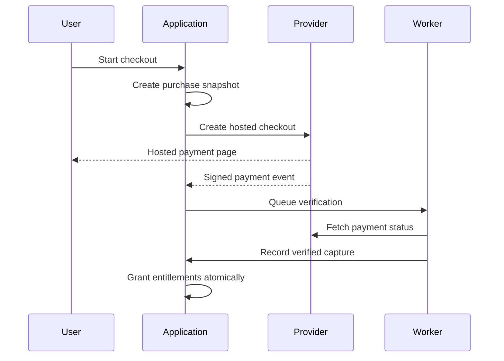

# Payment Architecture

**File:** `docs/08_PAYMENT_ARCHITECTURE.md`  
**Project:** AI Digital Invitation Platform  
**Status:** Approved — Owner Approved  
**Version:** 1.0  
**Approved date:** 2026-08-17  
**Depends on:** `docs/00_CLAUDE_RULES.md` through `docs/07_AI_ARCHITECTURE.md`

---

## 1. Purpose

This document defines the MVP payment architecture for one-time event packages. It covers provider selection boundaries, checkout, verification, idempotency, entitlements, refunds, disputes, reconciliation, security, and failure recovery.

It does not approve package prices. Pricing rules belong in `product/PRICING_RULES.md`.

---

## 2. Commercial scope

The MVP sells one-time packages attached to one event.

- No recurring consumer subscriptions.
- No stored platform wallet or customer balance.
- No marketplace split payments.
- No peer-to-peer transfers.
- No installment or credit product offered by the platform.
- No cryptocurrency.
- No manual “mark as paid” for ordinary production purchases.
- Publication requires a verified successful payment and valid entitlement.

The launch market is Mauritius, but the data model and provider interface must support additional countries and currencies later.

---

## 3. Current provider findings

### 3.1 JouJouPay

The original idea named JouJouPay. As of 2026-08-17, current research did not find verifiable official evidence for a Mauritian payment provider under that name: no official merchant website, API reference, pricing, terms, privacy notice, sandbox, or licensing record was located.

Therefore:

- JouJouPay is **not approved** as the MVP provider;
- no adapter may be built from assumed endpoints or unofficial descriptions;
- it may be reconsidered only if the owner supplies the exact legal entity and official merchant/API documentation and the provider passes the selection gate.

### 3.2 Verifiable Mauritius candidates

**MIPS** publicly describes itself as a Mauritius payment orchestrator connecting merchants with banks, financial institutions, payment providers, cards, and local methods including POP, Juice, my.t money, and blink. Its public material mentions APIs and PCI DSS compliance, but the exact merchant API, webhook, refund, settlement, fee, and sandbox terms must be obtained during onboarding.

**Peach Payments** publicly markets Mauritius support for local methods including MCB Juice and blink by Emtel. Exact API access, card acquiring, settlement, supported currencies, merchant pricing, webhooks, refunds, and contractual terms must be confirmed directly.

**Stripe** is not currently listed on Stripe's official global availability page as supporting Mauritius-based businesses for Stripe Payments. It is not an MVP option unless the business later has a legitimate entity in a supported jurisdiction and legal/tax review approves that structure. Stripe Atlas is not a technical shortcut and must not be used solely to bypass availability.

### 3.3 Regulatory gate

The Bank of Mauritius regulates payment systems and provides a Payment Service Provider licensing process under the National Payment Systems framework. Before contracting with a non-bank payment intermediary, verify the provider's legal entity, role, licensing/authorization status, acquiring-bank relationship, settlement responsibility, and applicable 2026 payment-aggregator rules directly with official records and the provider.

---

## 4. Provider-selection decision

Do not name a primary payment provider yet.

Run a documented commercial and technical selection between at least MIPS and Peach Payments. Selection requires written confirmation of:

1. onboarding eligibility for the Mauritian business entity;
2. supported payment methods and customer geographies;
3. MUR presentment and settlement;
4. international card acceptance and supported currencies;
5. hosted/mobile checkout quality;
6. sandbox/test environment;
7. server-side payment-status lookup;
8. signed or otherwise authenticated webhooks;
9. unique transaction and event identifiers;
10. idempotent payment creation or a safe equivalent;
11. full and partial refunds;
12. chargeback/dispute information;
13. settlement and reconciliation reports;
14. fee schedule, reserves, payout timing, and refund fees;
15. PCI DSS scope and responsibilities;
16. privacy, retention, subprocessors, incident handling, and data location;
17. uptime/support commitments and escalation path;
18. production credential rotation and environment separation.

No provider is approved based only on a marketing page or sales promise. A sandbox proof must pass the contract tests in this document.

### 4.1 Payment methods

The MVP should prioritize payment methods that are practical for Mauritian and international customers.

Subject to final confirmation from the selected payment provider and acquiring bank, supported payment methods should include:

- Visa;
- Mastercard;
- MCB Juice;
- MauCAS QR payments, including compatible Mauritian banking/payment applications such as SBM Tag where supported;
- other approved local methods such as blink where commercially justified.

The Bank of Mauritius describes MauCAS QR as an interoperable national merchant-payment standard. SBM officially states that SBM Tag can scan and pay merchant MauCAS QR codes. These facts establish customer-side compatibility with MauCAS QR; they do not establish that SBM Tag exposes a standalone online-payment API.

Integration should therefore occur through a verified provider-supported MauCAS or equivalent payment flow unless official SBM merchant/API documentation confirms otherwise.

No payment method may be advertised as supported until its production availability, merchant eligibility, settlement arrangements, and technical integration have been verified.

### 4.2 Payment security

Payment security is a critical and non-negotiable requirement.

The platform must minimize its payment attack surface through:

- provider-hosted or provider-controlled checkout;
- reputable PCI-DSS-aligned payment providers;
- 3-D Secure or equivalent protections where supported;
- server-side price, currency, merchant-account, and transaction verification;
- authenticated and idempotent webhook handling;
- strong authentication and authorization;
- least-privilege access;
- secure secrets management;
- rate limiting and abuse protection;
- audit logging;
- payment reconciliation;
- monitoring and alerting;
- dependency and security testing;
- defense in depth.

The application must never store, process, or log raw card numbers, CVV/CVC values, PINs, banking credentials, or payment-authentication secrets.

Browser redirects, frontend state, and client-provided payment values must never be considered proof of payment.

No known critical or high-severity payment-security vulnerability may remain unresolved at production launch.

No architecture can guarantee that a system is impossible to attack. The objective is to prevent compromise wherever reasonably possible, minimize attack surfaces, detect suspicious activity, contain failures, and maintain secure recovery procedures.

---

## 5. Provider abstraction

```ts
interface PaymentProvider {
  createCheckout(input: CreateCheckoutInput): Promise<CheckoutSession>;
  getPayment(input: GetPaymentInput): Promise<ProviderPayment>;
  verifyWebhook(input: VerifyWebhookInput): Promise<VerifiedPaymentEvent>;
  refund(input: RefundInput): Promise<ProviderRefund>;
  healthCheck(): Promise<ProviderHealth>;
}
```

The internal contract uses platform terms rather than provider-specific statuses. Provider SDKs and payloads remain inside infrastructure adapters.

The MVP implements one production adapter only. A provider simulator/fake is required for tests. A second live adapter is built only when commercial continuity justifies its maintenance cost.

---

## 6. Hosted checkout

Use a provider-hosted or provider-controlled checkout for MVP whenever available.

The application must not collect, transmit, log, or store raw card numbers, CVV/CVC, PINs, banking credentials, or wallet authentication secrets.

The platform creates a purchase snapshot first, then asks the provider to create checkout for the server-calculated amount and currency. The provider receives:

- opaque purchase/payment-attempt reference;
- amount and currency;
- safe description;
- success/cancel return URLs;
- webhook/callback configuration where applicable;
- minimum payer information required by the provider.

Return URLs contain no secrets and do not determine payment success.

---

## 7. Authoritative payment flow



The browser redirect may display “Payment is being verified.” It cannot mark a purchase paid.

Successful payment requires server-side evidence from an authenticated webhook and/or provider status lookup. When webhooks are unavailable, polling may be used, but only against the authenticated server API.

---

## 8. Amount and currency integrity

MUR is the platform's primary and base commercial currency. Mauritian customers should normally see and pay prices in MUR.

For customers outside Mauritius, the platform may support checkout in EUR and/or USD where the selected payment provider and acquiring bank officially support those currencies. Multi-currency support must not be assumed merely because the platform is globally accessible.

Before EUR or USD checkout is enabled, the business must define:

- supported presentment currencies;
- settlement currency;
- source of exchange rates;
- exchange-rate update frequency;
- FX margin or provider conversion costs;
- rounding rules;
- refund behaviour after exchange-rate changes;
- accounting treatment.

The server calculates prices from the approved price-book entry. Money uses integer minor units with an ISO currency code. Client-submitted amount, package name, discount, tax, exchange rate, or currency is never authoritative.

The purchase snapshot freezes the authoritative amount, currency, exchange-rate reference where applicable, and commercial terms before checkout. Verification compares provider amount and currency to that snapshot. Any mismatch blocks fulfillment and creates an operational alert. Overpayment or unsupported currency is never silently converted into entitlement.

Currency selection must not depend solely on IP geolocation. Customer country, billing information, explicit currency choice, and approved commercial rules may be used where appropriate.

---

## 9. Internal payment states

### Purchase

`CREATED`, `PAYMENT_PENDING`, `PAID`, `CANCELLED`, `EXPIRED`, `REFUNDED`, `PARTIALLY_REFUNDED`, `DISPUTED`.

### Payment attempt

`CREATED`, `PENDING`, `SUCCEEDED`, `FAILED`, `CANCELLED`, `EXPIRED`.

### Webhook/event processing

`RECEIVED`, `VERIFIED`, `PROCESSING`, `PROCESSED`, `IGNORED`, `FAILED_RETRYABLE`, `FAILED_FINAL`.

### Financial transaction

Append-only types: `CAPTURE`, `REFUND`, `PARTIAL_REFUND`, `REVERSAL`, `CHARGEBACK`.

Provider statuses are mapped explicitly. Unknown statuses do not become success; they are stored as normalized operational metadata and escalated.

---

## 10. Idempotency and duplicate handling

At-least-once delivery is assumed.

- Checkout creation has an application idempotency key.
- Provider idempotency is used when supported.
- Provider event IDs are unique per provider.
- Provider transaction IDs and transaction types are unique per provider.
- Duplicate webhooks return a successful acknowledgement after verifying that the event was already processed.
- Payment verification, purchase transition, entitlement grant, audit event, and outbox event occur in one database transaction.
- Entitlement grant uses its own stable ledger idempotency key derived from the verified financial transaction.
- Retrying a crashed worker cannot double-charge or double-grant.

Never rely on in-memory locks for financial correctness.

---

## 11. Webhook security

The webhook endpoint must:

1. accept only HTTPS;
2. read the raw body when signature verification requires it;
3. enforce strict body-size and content-type limits;
4. verify the provider signature/MAC using the documented algorithm;
5. verify timestamp tolerance or nonce where supported;
6. reject malformed, unsigned, expired, or replayed payloads;
7. allow-list event types;
8. record provider event ID and a payload digest;
9. acknowledge quickly after durable receipt;
10. process business effects asynchronously and idempotently;
11. redact sensitive data from logs and stored payloads;
12. rate-limit abuse without blocking legitimate provider retries.

IP allow-listing may be defense in depth when the provider publishes stable ranges. It is never the only authenticity check.

If a candidate cannot provide signed webhooks, the architecture must use authenticated server-side status retrieval before fulfillment and document the residual risk.

---

## 12. Payment verification transaction

For a successful capture, the worker:

1. locks the purchase/payment attempt;
2. confirms the event has not been processed;
3. retrieves authoritative provider status when required;
4. checks provider, merchant account, transaction ID, purchase reference, amount, currency, and terminal success state;
5. inserts the append-only capture transaction;
6. marks the payment attempt successful;
7. marks the purchase paid;
8. appends entitlement grants from the immutable purchase snapshot;
9. appends audit and outbox events;
10. commits once.

No AI generation, publication, email, storage, or provider network call occurs inside this database transaction.

---

## 13. Publication gate

Payment and publication remain separate transitions.

Publishing requires:

- a verified paid purchase for the event;
- the required active entitlements;
- a validated current invitation version;
- an owner-authorized publish action;
- no event/account suspension;
- no unresolved payment reversal preventing fulfillment.

Hosting begins at first successful publication, not payment time. Paying does not automatically publish.

---

## 14. Failed, abandoned, and uncertain payments

- A failed or cancelled payment does not grant entitlements.
- An expired checkout remains immutable; a new attempt may be created against the same valid purchase or a new purchase snapshot according to pricing validity.
- An abandoned browser session remains pending until provider status or expiry resolves it.
- If provider response is uncertain, show “verifying” rather than “failed” or “paid.”
- A timed-out API call is not proof the charge failed; query the provider using the idempotency/reference key before retrying creation.
- Orphaned provider payments enter an operational reconciliation queue and are never auto-attached by amount alone.

---

## 15. Refunds

Refunds are administrative/support actions in MVP.

- The operator selects the verified transaction and enters a reason.
- The server verifies refundable amount and currency.
- A stable refund idempotency key is created before calling the provider.
- Provider confirmation is recorded as an append-only refund transaction.
- Full and partial refunds are supported only if the chosen provider proves support.
- Failed/uncertain refund calls are reconciled before retrying.
- Refunds never delete the original capture.
- Every initiation, failure, completion, and manual decision is audited.

### Entitlement/publication consequences

Refund policy will be finalized in `product/PRICING_RULES.md`, but the architecture supports:

- refund before publication: revoke unused entitlements and prevent publication;
- refund after publication: apply the approved commercial policy rather than automatically destroying customer content;
- partial refund: record the amount and apply an explicit entitlement adjustment, never infer it from percentage alone;
- provider fee not returned: account for it operationally without changing the customer refund record.

---

## 16. Chargebacks and reversals

A dispute, chargeback, or reversal:

- is recorded as a new financial transaction/state event;
- creates an urgent audit/operations event;
- may suspend new generation or publication according to policy;
- must not erase evidence or prior invitation versions;
- may unpublish an active invitation only through an explicit, auditable rule or administrator action;
- is reconciled against provider reports.

The MVP does not automate submission of dispute evidence unless the selected provider and later roadmap justify it.

---

## 17. Reconciliation

Webhooks are not the only operational control.

Run scheduled reconciliation that compares:

- platform purchases and payment attempts;
- provider transactions/refunds/disputes;
- settlement or payout reports;
- entitlement grants and revocations;
- provider fees where available.

Reconciliation detects:

- provider-paid but platform-pending transactions;
- platform-paid records missing provider evidence;
- amount/currency mismatches;
- duplicate captures;
- missing/duplicate entitlement grants;
- refunds or chargebacks not received by webhook;
- unsettled or delayed funds.

Differences become cases for review. Automated repair is restricted to deterministic idempotent actions and remains audited.

---

## 18. PCI and sensitive-data boundaries

The product should minimize PCI DSS scope by using hosted checkout and never handling cardholder data directly.

Do not store or log:

- PAN/card number;
- CVV/CVC;
- PIN;
- magnetic-stripe/chip data;
- wallet credentials;
- online-banking credentials;
- full provider secrets;
- raw authentication headers.

Permitted display metadata, if returned and contractually allowed, is limited to safe fields such as payment method type, card brand, last four digits, and expiry month/year. Even these are optional and must have a business purpose.

Using hosted checkout reduces scope; it does not eliminate security, PCI, privacy, or provider-contract duties.

---

## 19. Secrets and environment separation

- Sandbox and production use distinct merchant accounts/credentials.
- Credentials live in the deployment secret system.
- Webhook secrets are separate from API credentials where the provider supports it.
- Keys are least-privilege, rotated, and revoked on suspected exposure.
- Secrets never enter browser code, Git, database rows, logs, analytics, support screenshots, or error reports.
- Return and webhook URLs are configured explicitly per environment.
- Production mode cannot be enabled merely by a client flag.

---

## 20. Privacy and data minimization

Send the provider only information required to process and reconcile payment.

- Prefer opaque internal purchase references over event titles or personal names.
- Do not send guest data.
- Avoid invitation details in payment descriptions.
- Collect payer identity only where required by the provider, fraud controls, receipt, tax, or law.
- Store redacted provider metadata and a payload digest by default.
- Raw webhook retention requires explicit Security Architecture approval.
- Provider privacy terms, subprocessors, international transfers, retention, and breach handling must be reviewed before launch.

---

## 21. Receipts and customer communication

The system may issue an application receipt only after verified payment.

Receipts include:

- merchant legal identity and contact details;
- receipt/purchase reference;
- date;
- package description;
- amount, currency, and tax treatment;
- safe payment-method summary if available;
- refund/support instructions.

Do not claim funds are settled merely because payment is authorized or captured. Provider receipts and platform receipts must not contradict one another.

Email delivery failure does not change payment status; receipts remain accessible from the authenticated dashboard.

---

## 22. Tax and accounting boundary

The platform records immutable commercial snapshots and verified movements. It must not invent or hardcode tax treatment before the applicable business rules have been professionally verified.

Any VAT, sales tax, or similar customer-payable tax legally applicable to a transaction must be calculated according to approved tax rules and clearly reflected in the final amount presented before payment.

Where the business is legally required to advertise tax-inclusive consumer prices, the displayed price must already include the applicable tax.

Taxes that are obligations of the business itself, such as corporate or income tax, must not automatically be added to a customer's checkout amount merely because the business is responsible for paying them.

Before launch, a Mauritius accounting/tax professional must confirm:

- business registration and merchant name;
- VAT registration status and invoice/receipt requirements;
- whether displayed prices include tax;
- tax point and refund treatment;
- record-retention requirements;
- treatment of international customers/currencies;
- treatment of EUR/USD transactions;
- provider fee and settlement accounting.

Tax calculation remains zero or explicitly configured until approved rules exist. Never silently assume VAT. The architecture must remain configurable so approved tax rules can be introduced without rewriting the payment system.

---

## 23. Availability and operational controls

- Payment outage does not affect already published invitations.
- Checkout creation has bounded timeout and retry behavior.
- Circuit breakers prevent cascading provider failures.
- Operations can pause new checkout while keeping status verification/reconciliation active.
- Alert on webhook verification failures, backlog age, amount mismatch, duplicate events, reconciliation differences, refund uncertainty, and provider error-rate spikes.
- A provider outage never permits bypassing payment verification.
- Manual bank transfer is excluded from self-service MVP checkout unless later designed as a fully reconciled separate method.

---

## 24. Observability

Track:

- checkout creation success/failure and latency;
- payment conversion by method without unnecessary personal data;
- pending-payment age;
- webhook receipt, verification, duplication, and processing latency;
- amount/currency mismatch count;
- refund and dispute states;
- settlement/reconciliation differences;
- entitlement-grant idempotency;
- provider availability and error codes;
- payment fees and net settlement where available.

Use correlation IDs across purchase, payment attempt, provider event, financial transaction, entitlement ledger, outbox, and audit event.

---

## 25. Test requirements

The selected adapter must pass tests for:

- hosted checkout creation;
- server-calculated amounts;
- MUR and provider-supported currency handling;
- signature verification with valid/invalid/replayed payloads;
- duplicate and out-of-order webhooks;
- success redirect arriving before webhook;
- webhook arriving before redirect;
- provider API timeout after possible charge creation;
- payment status lookup;
- amount, currency, merchant-account, and reference mismatch;
- exactly-once capture recording and entitlement grant;
- failed/cancelled/expired checkout;
- full and partial refund, including retry uncertainty;
- reversal/chargeback mapping;
- unknown provider status;
- reconciliation imports/API results;
- secret and sensitive-data redaction;
- sandbox/production separation.

A real sandbox end-to-end test is mandatory before provider approval. Provider fakes alone are insufficient.

---

## 26. Provider exit plan

Provider replacement must not require changing domain entities or historical financial truth.

- Historical records retain their original `provider_code` and opaque IDs.
- New checkout can route to a newly approved provider by configuration.
- Old provider webhooks/status/reconciliation remain operational through the required retention period.
- Never rewrite old transactions to appear as if processed by the new provider.
- Export settlement and dispute data before termination.
- Revoke credentials only after in-flight payments/refunds and reporting obligations are resolved.

---

## 27. Explicit MVP exclusions

- recurring billing and subscriptions;
- saved cards and platform token vault;
- merchant marketplace/split settlements;
- coupons, gift cards, credits, wallets, and loyalty points;
- buy-now-pay-later;
- cryptocurrency/stablecoin checkout;
- automated foreign exchange;
- multi-provider smart routing;
- offline cash and manual payment approval;
- automated dispute-evidence submission;
- direct handling of card data.

---

## 28. Current-source notes

Official/current sources reviewed:

- Bank of Mauritius payment-system licensing: <https://www.bom.mu/payment-systems/licensing/application-for-licences>
- Bank of Mauritius public notice on payment-service-provider licensing: <https://www.bom.mu/media/media-releases/public-notice-bank-mauritius-issues-regulations-under-national-payment-systems-act-2018>
- Bank of Mauritius MauCAS QR interoperability and merchant-payment purpose: <https://www.bom.mu/maucasqrcode/speech_gov_qrcode>
- SBM Tag official MauCAS merchant-QR capability: <https://banking.sbmgroup.mu/sbm-tag>
- MCB confirmation of MCB Juice e-commerce checkout through Peach Payments: <https://mcb.mu/private-wealth/news/ecommerce-partnership-with-peach-payments-for-mcb-juice>
- MIPS official overview and Mauritius payment-method relationships: <https://www.mips.mu/>
- MIPS/POP online payment integration claims: <https://www.mips.mu/pop/>
- Peach Payments for MCB Juice: <https://www.peachpayments.com/pay-with/mcb-juice/>
- Peach Payments for blink by Emtel: <https://www.peachpayments.com/pay-with/blink-by-emtel>
- Stripe official global availability: <https://stripe.com/global>

Provider facts, licensing status, fees, API features, and regulations are time-sensitive and must be rechecked before selection and launch.

---

## 29. Approved owner decisions

### Decision 1 — JouJouPay

**Approved:** Remove JouJouPay as the assumed provider because no verifiable official/API/licensing evidence was located. Reconsider it only with exact official documentation and legal-entity details.

### Decision 2 — Provider selection

**Approved:** Do not lock a provider in this document. Conduct a sandbox-backed selection between MIPS and Peach Payments, then record the winner in an architecture decision before implementation of production payments.

### Decision 3 — Stripe

**Approved:** Exclude Stripe from the Mauritius MVP because Mauritius is not currently listed as a supported business location for Stripe Payments. Re-evaluate only if official availability changes or the business legitimately operates from a supported jurisdiction.

### Decision 4 — Checkout

**Approved:** Use provider-hosted checkout and never collect or store raw card/banking credentials.

### Decision 5 — Payment truth

**Approved:** Treat authenticated server-side provider verification as authoritative. Browser redirects never mark a purchase paid.

### Decision 6 — Fulfillment transaction

**Approved:** Record verified capture, transition purchase, grant entitlements, and append audit/outbox events atomically and idempotently.

### Decision 7 — Currency

**Approved:** Use MUR as the platform's base and primary Mauritius currency. Preserve multi-currency architecture and permit EUR and/or USD checkout for international customers only where the selected payment provider/acquirer confirms support and the FX, settlement, tax, and accounting rules have been approved.

### Decision 8 — Refunds

**Approved:** Make refunds support/admin actions in MVP, supporting full/partial refunds only after the provider proves those capabilities. Never delete original financial records.

### Decision 9 — Reconciliation

**Approved:** Require scheduled provider/settlement reconciliation in addition to webhooks before launch.

### Decision 10 — Payment Methods

**Approved:** Prioritize Visa, Mastercard, MCB Juice, and MauCAS QR payments, including compatible applications such as SBM Tag where supported by the selected provider. Consider blink and additional local methods where commercially justified. Do not build separate direct integrations for each wallet during the MVP unless necessary.

### Decision 11 — Subscriptions and manual payments

**Approved:** Exclude recurring subscriptions, saved cards, manual bank-transfer approval, cash, wallets/credits, split payments, BNPL, and cryptocurrency from MVP.

### Decision 12 — Tax readiness

**Approved:** Require professional Mauritius accounting/tax review before production launch. Customer-payable taxes must be calculated using approved rules and clearly included or disclosed as legally required. Business-level taxes must not automatically be passed to customers. International tax and multi-currency treatment must be explicitly approved before international checkout is enabled.

---

## 30. Approval record

**Status:** Approved — Owner Approved.  
**Approved version:** 1.0.  
**Approved date:** 2026-08-17.  
**Owner decisions:** Decisions 1–12 approved, including the owner-approved revisions to Decisions 7, 10, and 12.
