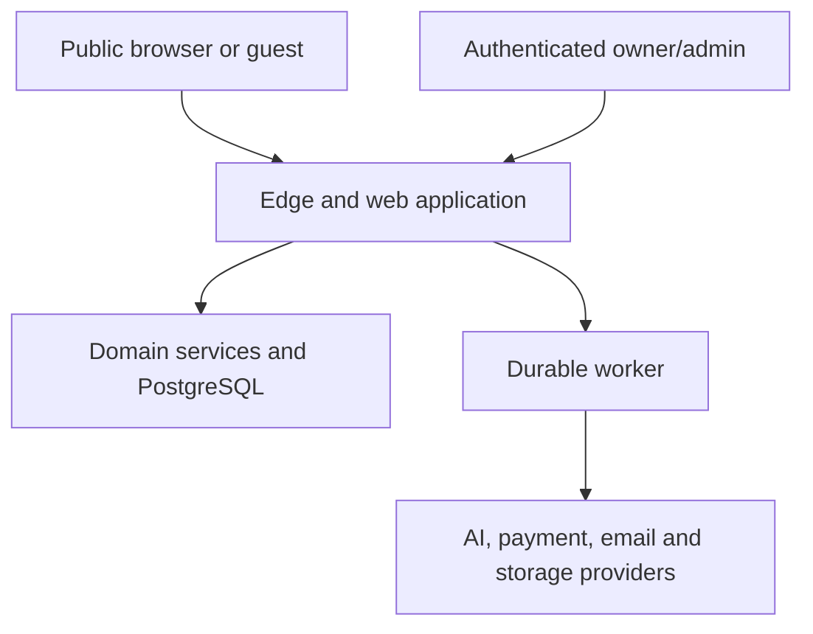

# Security Architecture

**File:** `docs/09_SECURITY_ARCHITECTURE.md`  
**Project:** AI Digital Invitation Platform  
**Status:** Approved — Owner Approved  
**Version:** 1.0  
**Approved date:** 2026-08-17  
**Depends on:** `docs/00_CLAUDE_RULES.md` through `docs/08_PAYMENT_ARCHITECTURE.md`

---

## 1. Purpose

This document defines the MVP security and privacy architecture. It establishes the threat model, trust boundaries, identity and authorization controls, public-invitation protections, data-protection duties, secure development practices, operational controls, incident response, and production launch gates.

Security is a continuous risk-management discipline. No architecture can guarantee that a platform is impossible to attack or that no breach will ever occur. The objective is to prevent compromise wherever reasonably possible, reduce attack surface, limit blast radius, detect suspicious activity, respond quickly, recover safely, and continually improve.

---

## 2. Security objectives

The system must protect:

1. account confidentiality and control;
2. unpublished invitation content;
3. guest names, contact details, and RSVP responses;
4. payment state and entitlement integrity;
5. AI usage and provider credentials;
6. published invitation availability and integrity;
7. administrative privileges and audit history;
8. source code, deployments, backups, and secrets;
9. the owner's and guests' privacy rights;
10. the ability to recover from failure or compromise.

Security controls must be proportional to actual risk and maintainable by a small MVP team. Complexity that cannot be operated safely is not a security improvement.

---

## 3. Security principles

- **Server authority:** clients propose actions; trusted server code authorizes and validates them.
- **Least privilege:** every user, service, credential, and database role gets only necessary access.
- **Defense in depth:** no single check is the sole barrier protecting a critical asset.
- **Deny by default:** unknown roles, states, inputs, webhook types, file types, and provider statuses are rejected.
- **Data minimization:** collect, transmit, retain, and expose only what is necessary.
- **Separation of duties:** migrations, runtime operations, administration, and provider integrations use distinct privileges where practical.
- **Immutable evidence:** financial, entitlement, version, RSVP-revision, and critical audit history is append-only.
- **Secure failure:** errors do not grant access, publish content, confirm payment, or leak sensitive details.
- **Explicit trust boundaries:** public URLs, browsers, guests, webhooks, AI providers, payment providers, object storage, and queues are untrusted inputs.
- **Verifiable controls:** important security claims require tests, monitoring, and evidence.

---

## 4. Compliance and legal baseline

The Mauritius Data Protection Act 2017 is the primary privacy baseline for a Mauritius-operated launch. The Data Protection Office states that the Act was proclaimed on 15 January 2018 and aligns with principles in the EU GDPR.

The business must obtain professional Mauritius legal/privacy advice before production launch. This document is an engineering design, not legal advice.

### 4.1 Controller and processor assessment

The operating business is expected to act as controller for account, event, guest, RSVP, purchase, support, and security data. Cloud, authentication, payment, email, observability, AI, and storage vendors may act as processors or independent controllers depending on their service and contract.

Before launch:

- identify the operating legal entity;
- document controller/processor roles for each data flow;
- determine and complete required registration with the Mauritius Data Protection Office;
- maintain current processor agreements and subprocessor records;
- identify a privacy contact and determine whether a formal Data Protection Officer is legally required;
- maintain a record of processing activities.

The Data Protection Office maintains a register of controllers and processors and publishes registration/renewal procedures. Registration status must be verified rather than assumed.

### 4.2 Processing principles

Personal data must be processed lawfully, fairly, transparently, for explicit legitimate purposes, limited to what is necessary, kept accurate, retained no longer than necessary, and processed consistently with data-subject rights.

Every data category needs:

- defined purpose;
- lawful basis;
- source;
- recipients/processors;
- storage location;
- retention period or criteria;
- deletion/anonymization rule;
- security classification;
- data-subject request behavior.

### 4.3 Data-subject rights

The system and operating process must support verified requests for:

- access and a copy of personal data;
- rectification;
- erasure where applicable;
- restriction of processing;
- objection, including to direct marketing;
- information about recipients, retention, source, and significant automated processing;
- complaint escalation to the Data Protection Commissioner.

Rights are not fulfilled through uncontrolled database deletion. The request workflow verifies identity, finds data across systems/providers/backups, applies legal retention exceptions, records decisions, and responds within the legally required period confirmed by counsel.

### 4.4 International transfers

Because hosting and AI/payment providers may process data outside Mauritius, each transfer must be mapped and reviewed. A provider cannot be approved until contractual, legal, location, subprocessor, security, and transfer safeguards are documented.

Data residency in a particular country is not assumed from a provider's headquarters or marketing region.

### 4.5 DPIA and privacy review

Complete a documented Data Protection Impact Assessment before launch and before any later high-risk change involving:

- large-scale guest data;
- identity/reference image generation;
- sensitive cultural/religious inference;
- extensive profiling or behavioral analytics;
- new international processing routes;
- automated decisions with significant effects;
- new public-data exposure.

The MVP explicitly avoids several of these activities, but the assessment records that decision and residual risk.

---

## 5. Data classification

| Class | Examples | Minimum treatment |
|---|---|---|
| Public | published invitation projection, public assets | integrity controls, safe caching, removal workflow |
| Internal | package configuration, non-sensitive operational metadata | authenticated staff/service access |
| Confidential | account profile, unpublished invitations, guest lists, RSVP history, support notes | authorization, encryption, minimization, audit where appropriate |
| Restricted | authentication/session data, payment evidence, provider secrets, security events, token hashes | strict least privilege, no client/log exposure, enhanced audit and retention controls |

Religious/cultural context may reveal sensitive beliefs. Even when voluntarily supplied for invitation design, treat it as confidential and process only for the explicit creative purpose. Do not use it for advertising, profiling, or unrelated analytics.

---

## 6. Threat model

### 6.1 Likely threat actors

- opportunistic internet attackers and automated bots;
- credential-stuffing and phishing operators;
- abusive users attempting free AI/payment bypass;
- malicious guests targeting RSVP/public endpoints;
- compromised user or administrator accounts;
- supply-chain compromise;
- malicious or compromised third-party provider;
- insider misuse or accidental disclosure;
- denial-of-service and resource-exhaustion attackers.

### 6.2 High-impact scenarios

1. Account takeover exposes unpublished events and guest lists.
2. Broken object-level authorization exposes another owner's event.
3. Forged payment state grants publication or entitlements.
4. Predictable or leaked invitation/token identifiers expose guest data.
5. Stored XSS executes through invitation copy, guest messages, or AI output.
6. SSRF is triggered through provider-returned or user-supplied URLs.
7. AI generation is abused to exhaust budget or produce prohibited content.
8. Secrets leak through Git, logs, client bundles, error traces, or support tools.
9. Dependency or CI/CD compromise modifies production.
10. Administrator misuse alters entitlements, refunds, or publication.
11. Backup/object-storage exposure leaks historical personal data.
12. Availability attack takes down public invitations during events.

### 6.3 Trust boundaries

Every arrow crosses a validation, authentication, authorization, or provider-verification boundary. Network location alone never establishes trust.

---

## 7. Authentication architecture

The authentication provider remains undecided until an implementation evaluation. Use a provider abstraction at the application boundary, but do not build a custom password system for MVP.

The selected provider must support:

- secure hosted or well-maintained authentication flows;
- verified email ownership;
- secure session cookies;
- session revocation and device/session management;
- MFA for administrators and preferably optional MFA for users;
- brute-force and credential-stuffing protection;
- account recovery with auditable security behavior;
- separate production/test tenants or environments;
- export/portability of stable subject identifiers;
- documented security, privacy, retention, and incident practices.

### 7.1 Session rules

- Use opaque or integrity-protected sessions in `Secure`, `HttpOnly`, appropriately scoped cookies.
- Use `SameSite=Lax` by default; exceptions require threat analysis.
- Rotate session identifiers after authentication and privilege changes.
- Enforce server-side revocation for logout, suspension, credential reset, and suspected compromise.
- Set absolute and inactivity expiry appropriate to risk.
- Require recent reauthentication for high-risk actions such as email change, account deletion, administrator privilege changes, refund, or secret rotation.
- Never store authentication tokens in `localStorage`.
- Sensitive authenticated responses use `Cache-Control: no-store`.

### 7.2 MFA

MFA is mandatory for `ADMIN` and `SUPPORT` accounts before production access. Prefer phishing-resistant WebAuthn/passkeys where supported; TOTP is an acceptable fallback. SMS must not be the only administrator MFA factor.

---

## 8. Authorization

Authentication answers who the actor is. Authorization is checked separately for every action and object.

- Every event has exactly one owning account in MVP.
- Event planners receive no extra privilege merely from profile classification.
- Repository queries must scope by owner or an explicit privileged authorization decision.
- Never authorize from client-supplied account, event, role, or ownership fields.
- Server Actions and route handlers are untrusted entry points and call the same domain authorization services.
- UI hiding is not authorization.
- Public slugs and guest tokens are capabilities with narrow scope, never owner/admin credentials.
- Support/admin actions require explicit role, action permission, reason, and audit event.
- Privilege changes require an administrator with appropriate authority and recent MFA/reauthentication.

Automated tests must attempt horizontal and vertical privilege escalation for every protected resource type.

---

## 9. Administrative security

Administrators create disproportionate risk and require stronger controls.

- No shared administrator accounts.
- MFA mandatory.
- Separate staff/admin interface and authorization policy.
- Least-privilege `SUPPORT` role cannot grant roles, change secrets, or alter audit history.
- Sensitive actions require reason codes and before/after audit snapshots.
- Refunds, entitlement adjustments, suspension, unpublishing, account access, and data exports are audited.
- Impersonation is excluded from MVP. If introduced later, it requires visible banners, consent/legal basis, time limits, and full audit.
- Production database access is exceptional, time-bound, attributable, and logged.
- Break-glass access uses separate protected credentials and post-incident review.

---

## 10. Public invitation security

A hard-to-guess public link reduces accidental discovery; it is not authentication.

- Generate at least 128 bits of cryptographic randomness for the public slug.
- Apply constant-shape not-found responses that do not reveal internal IDs or unpublished existence.
- Publish only the strict public projection defined in Documents 05 and 06.
- Never expose owner email, internal IDs, payment data, guest list, planner notes, provider metadata, unpublished versions, or audit records.
- Expired, unpublished, suspended, or removed invitations fail closed.
- Slug rotation invalidates the previous slug after a controlled grace policy, normally immediately for security events.
- Use rate limits and anomaly detection against enumeration.
- Set appropriate search-engine directives. The default is `noindex, nofollow` because invitations are link-shared, not public-search content.
- Open Graph previews contain only owner-approved public content and no guest-specific data.
- QR codes encode the public HTTPS URL only.

Password-protected invitations are not required for MVP. If added later, they require a separate threat and UX design.

---

## 11. Guest RSVP security

Guests may RSVP without accounts.

- RSVP endpoints validate event publication, RSVP-open state, deadline, party capacity, and rate limits server-side.
- Guest response-management tokens contain high entropy and are stored only as hashes.
- Tokens are scoped to one guest party, expire, can be revoked, and cannot access the host dashboard.
- Do not reveal whether arbitrary names/emails exist in the guest list.
- Guest messages are length-limited, normalized, and rendered as text—not HTML.
- RSVP revisions are immutable and idempotent.
- Raw IP addresses are not stored by default; keyed short-lived digests may support abuse controls after privacy approval.
- CAPTCHA or managed bot challenges may be introduced adaptively after rate/anomaly thresholds, not forced universally without evidence.
- CSV imports are validated, deduplicated, access-controlled, and deleted after short retention.

---

## 12. Input validation and output encoding

- Validate all HTTP, Server Action, webhook, queue, provider, CSV, and AI data against explicit schemas.
- Reject unknown fields for security-sensitive contracts.
- Apply byte, character, collection, nesting, and file-size limits before expensive processing.
- Normalize Unicode intentionally while preserving legitimate global names.
- Parameterize SQL; never concatenate untrusted values into queries.
- Render user and AI text through framework escaping.
- Do not use unsafe HTML injection for invitation content.
- Sanitize any future rich text through a narrow allow-list on the server and test it against XSS payloads.
- Validate redirects against explicit internal paths or allow-listed origins.
- Validate URLs by parsed scheme/host; reject userinfo, unsupported schemes, local/private/link-local addresses, redirects to disallowed targets, and DNS rebinding paths.
- Error responses expose stable safe codes, not stack traces, SQL, secrets, or provider payloads.

---

## 13. Browser and web controls

Use a restrictive security-header baseline:

- Content Security Policy with nonces/hashes and no uncontrolled `unsafe-inline` scripts;
- `Strict-Transport-Security` after HTTPS deployment is stable;
- `X-Content-Type-Options: nosniff`;
- `Referrer-Policy: strict-origin-when-cross-origin` or stricter on sensitive pages;
- `Permissions-Policy` disabling unused browser capabilities;
- frame protection through CSP `frame-ancestors`;
- appropriate COOP/CORP where compatible;
- secure cookie attributes;
- `Cache-Control: no-store` for authenticated/private responses.

State-changing cookie-authenticated requests require CSRF protection through SameSite cookies plus origin validation and framework-supported anti-CSRF mechanisms where applicable. CORS is deny-by-default and does not replace CSRF protection.

Third-party scripts increase supply-chain and privacy risk. Analytics, chat, pixels, and tag managers require explicit approval, CSP inclusion, and data-flow review. Guest pages have no advertising.

---

## 14. API and abuse protection

There is no general public API in MVP. Public web endpoints still require API-grade protection.

Rate limits are keyed using multiple signals appropriate to privacy and threat level:

- account and session;
- event/public slug;
- guest token;
- normalized network signal;
- provider event ID;
- global system budget.

Separate limits apply to login/recovery, event creation, AI generation, checkout, payment status, RSVP, public rendering, CSV import, and administrative actions.

Limits fail safely, are observable, and avoid using attacker-controlled headers without trusted-proxy normalization. Resource limits also cap AI cost, database work, file transfer, and queue depth.

Use edge/WAF/bot controls as supplemental defenses, not substitutes for application validation and authorization.

---

## 15. Payment security

Document 08 is authoritative. Security-specific requirements include:

- provider-hosted checkout;
- no raw card/banking credential handling;
- authenticated server-side verification;
- signed/authenticated, replay-resistant, idempotent webhooks;
- server-side amount, currency, merchant-account, reference, and status comparison;
- atomic verified-capture and entitlement grant;
- immutable transaction history;
- reconciliation independent of webhooks;
- separate sandbox/production credentials;
- no unresolved known critical/high payment-security vulnerability at launch.

Browser redirects and client values never prove payment. A provider outage never authorizes bypass.

---

## 16. AI security

Document 07 is authoritative. Security requirements include:

- user input remains untrusted data, not system instruction;
- provider calls occur server-side;
- minimum necessary event/creative data is transmitted;
- no guest lists, payment data, or planner private notes are sent;
- exact provider/model and data-handling route is approved;
- text output is schema-validated and rendered safely;
- image outputs are verified and ingested into controlled storage;
- no generated HTML, JavaScript, executable SVG, CSS, or arbitrary URL execution;
- entitlement and global cost limits prevent resource abuse;
- no automatic undisclosed cross-provider failover;
- cultural/religious identity is never inferred from names or photos.

Prompt injection cannot authorize domain actions because the model has no direct database, payment, publication, secret, or administrator tools.

---

## 17. File, asset, and SSRF security

MVP accepts only the documented file types required for CSV guest import and platform/provider-generated assets. User image uploads are deferred unless separately approved.

- Validate extension, declared type, magic bytes, decoded format, dimensions, and size.
- Generate storage keys server-side.
- Keep source/private objects non-public.
- Serve public assets through controlled immutable references or signed access as appropriate.
- Disable execution/content sniffing through correct content types and headers.
- Strip dangerous metadata where required.
- Malware scanning is required for untrusted document/archive types if later introduced.
- Provider URL ingestion uses strict allow-lists or an isolated fetcher with DNS/IP validation, redirect limits, timeouts, byte limits, and no access to private networks/cloud metadata.
- Object deletion and publication revocation are separate, auditable lifecycle operations.

---

## 18. Secrets and cryptography

- Secrets live in the deployment secret manager/environment, never Git, database business tables, client bundles, logs, analytics, or documentation examples.
- Use separate credentials by environment and provider.
- Scope and rotate credentials; record owners and expiry/rotation expectations.
- Revoke immediately after suspected exposure.
- Protect webhook secrets independently where possible.
- Encrypt traffic in transit with modern TLS.
- Use provider-managed encryption at rest for databases, backups, queues, and object storage, with key-management review.
- Use platform cryptographic libraries; never design custom encryption algorithms.
- Generate tokens with a cryptographically secure random generator.
- Store guest tokens through an appropriate keyed hash or slow hash based on token entropy/threat model.
- Use constant-time comparison for authentication codes/signatures where applicable.

Field-level encryption is used only for an identified threat/requirement and must include key rotation, access, search, backup, and recovery design. Encrypting everything indiscriminately can create unrecoverable systems without reducing the main risk.

---

## 19. Database security

- Managed PostgreSQL is private/non-public where the provider allows it.
- TLS is required for non-local connections.
- Distinct migration, runtime, worker, read-only/reporting, and emergency roles are used where practical.
- Runtime roles cannot alter schema.
- Normal roles cannot update/delete append-only audit and financial/entitlement history.
- Queries are parameterized and authorization-scoped.
- Backups, replicas, exports, and snapshots receive the same classification as primary data.
- Production data is not copied into development/test environments.
- Sanitized synthetic data is used for testing.
- Database activity, privilege changes, failed authentication, backup status, and risky operations are monitored where supported.

PostgreSQL row-level security may be added as defense in depth after authentication/provider topology is known. Application authorization remains mandatory. RLS policies require dedicated bypass/ownership tests before production.

---

## 20. Queue, worker, and outbox security

- Queue/job payloads contain IDs and minimized data, not secrets or large personal-data snapshots.
- Workers authenticate to infrastructure with separate least-privilege credentials.
- Job type and payload schema are allow-listed and versioned.
- Duplicate, delayed, out-of-order, and poisoned jobs are expected.
- Each handler is idempotent and rechecks current authorization/business state where necessary.
- Retries are bounded; dead-letter/final-failure states are monitored.
- A job cannot select arbitrary provider endpoints or execute arbitrary code.
- The transactional outbox prevents critical domain changes from being lost.

---

## 21. Logging, audit, and privacy

### Operational logs

Use structured logs with timestamp, environment, service, severity, stable error code, and correlation ID.

Never log:

- passwords, sessions, tokens, API keys, webhook signatures;
- raw card/bank data;
- full payment or AI provider payloads;
- full guest lists or CSV rows;
- unrestricted invitation content or cultural/religious context;
- raw IP addresses beyond an approved security retention need;
- database connection strings.

### Audit events

Critical audit events are append-only and record actor, action, target, time, reason where required, correlation ID, and minimized before/after state. Audit access is restricted and itself auditable.

Audit events include:

- role/privilege changes;
- suspension/restoration;
- refund/dispute actions;
- entitlement adjustments;
- payment verification anomalies;
- publication/unpublication/removal;
- data exports/deletion decisions;
- security-setting and secret changes;
- emergency access.

Logs and audits have documented, different retention policies. Sensitive values are redacted at source, not only in the log viewer.

---

## 22. Monitoring and detection

Alert on:

- authentication/recovery anomalies and administrator MFA failures;
- horizontal-authorization denials and enumeration patterns;
- unusual guest-token or public-slug access;
- AI/checkout/RSVP rate-limit spikes;
- webhook signature failures and replay attempts;
- payment amount/currency mismatch;
- entitlement reconciliation mismatch;
- administrator privilege changes and break-glass use;
- secrets or dependency alerts;
- CSP violations after tuning;
- storage/database public-access configuration changes;
- backup, restore, queue, worker, and outbox failures;
- unexpected egress/provider destination;
- large data export or deletion activity.

Alerts must route to a monitored channel with severity, owner, runbook, and escalation expectations. Collecting alerts without response ownership is not a security control.

---

## 23. Secure development lifecycle

### Design and coding

- Threat-model new high-risk features.
- Use strict TypeScript and explicit validation.
- Require review for auth, payments, entitlements, public projections, secrets, migrations, and security configuration.
- Keep provider SDKs isolated.
- Prohibit disabled security checks or hardcoded test bypasses in production.

### Automated checks

- linting, type checking, and tests;
- secret scanning;
- dependency and lockfile vulnerability scanning;
- static application security testing;
- infrastructure/configuration scanning when infrastructure code exists;
- software bill of materials generation for releases where tooling supports it;
- migration and authorization integration tests;
- dynamic security tests against staging for critical flows.

### Dependency policy

- Commit the lockfile.
- Pin direct production dependencies within the approved update strategy.
- Minimize dependencies and installation scripts.
- Review maintainer/repository health and license for important packages.
- Patch exploitable vulnerabilities promptly according to severity and exposure.
- Do not apply automated major upgrades directly to production.

OWASP ASVS 5.0 is the application-security verification baseline. The team will select applicable Level 2 controls for the internet-facing SaaS and document justified exclusions; payment-specific controls remain additive.

---

## 24. CI/CD and source-control security

- Require MFA for source-control and deployment accounts.
- Protect the production branch with review/check requirements when collaboration begins.
- Use least-privilege short-lived CI credentials or workload identity where available.
- Do not expose secrets to untrusted pull-request code.
- Pin or carefully control third-party CI actions.
- Build once and promote the same artifact where deployment tooling supports it.
- Record commit, artifact, migration, approver, and deployment identity.
- Production deployment permissions are separate from ordinary repository write access.
- Rollback is tested and does not require disabling security controls.
- Environment variables marked public are reviewed to prevent secret leakage into browser bundles.

---

## 25. Infrastructure and network security

Kubernetes remains excluded from MVP. Its absence does not reduce the application controls required here.

- Use managed services with supported patching, encryption, backup, access controls, and audit capabilities.
- Expose only required public web endpoints.
- Keep database, internal storage, and administrative services private or strongly access-controlled.
- Separate development, staging, and production accounts/projects where feasible.
- Restrict outbound traffic/destinations where supported, especially provider asset fetching.
- Disable unused services, ports, default credentials, and public buckets.
- Automate security updates with controlled testing and rollout.
- Maintain inventory of externally reachable services and provider integrations.
- Verify custom domains, DNS, certificates, and anti-takeover configuration.

Provider selection belongs in Deployment Architecture; security requirements are mandatory regardless of vendor.

---

## 26. Backups and recovery

- Encrypt automated backups and restrict access.
- Define RPO and RTO in Deployment Architecture.
- Support point-in-time recovery where commercially practical.
- Test restoration into an isolated environment on a schedule.
- Protect and monitor deletion of backups.
- Document how revoked/deleted personal data ages out of backups.
- Keep restoration credentials and procedures available during provider/account failure.
- Restoration testing verifies application integrity, not only database boot.

Ransomware/destructive-action scenarios must be part of the recovery exercise. A backup that has not been restored successfully is not trusted.

---

## 27. Incident response

Maintain a concise incident-response plan covering:

1. detection and reporting;
2. severity classification;
3. incident commander and contacts;
4. containment without destroying evidence;
5. credential/session/token revocation;
6. provider and legal escalation;
7. forensic timeline and evidence preservation;
8. safe recovery and heightened monitoring;
9. data-breach assessment and required notifications;
10. customer/data-subject communication;
11. post-incident review and tracked corrective actions.

The exact Mauritius personal-data-breach notification duties and time limits must be confirmed from the Act, Data Protection Office guidance, and legal counsel before launch. The runbook records the Data Protection Office contact and provider incident channels.

Security incidents are never concealed by deleting audit data. Public statements must be factual, approved, and proportionate.

---

## 28. Retention and deletion architecture

Before production, create an approved retention schedule for:

- account/profile data;
- event and invitation versions;
- guest parties, contacts, and RSVP revisions;
- generated content and assets;
- AI operational metadata;
- payment, refund, settlement, and tax/accounting records;
- security/operational logs;
- audit events;
- support records;
- backups.

Deletion uses a controlled lifecycle:

1. authenticate and authorize the request;
2. preserve legally required financial/security evidence;
3. revoke public access and tokens;
4. delete or anonymize eligible primary data;
5. propagate to processors/providers where required;
6. record a minimized audit event;
7. allow backups to age out under documented controls.

Do not retain guest data “just in case.” Do not delete evidence required for legal claims, accounting, fraud, or security without approved policy.

---

## 29. Security testing and launch gates

Production launch is blocked until:

- threat model and data-flow inventory are reviewed;
- Data Protection Office registration/legal obligations are confirmed;
- privacy notice, terms, processor list, and rights-request process exist;
- authentication provider is security-reviewed;
- admin MFA is enforced;
- authorization tests cover every protected entity/action;
- public projection and RSVP/token tests pass;
- payment provider sandbox/security contract passes;
- AI output, prompt-injection, file, and SSRF tests pass;
- secret, dependency, SAST, and relevant DAST scans pass;
- CSP/security headers are verified in staging;
- backup restoration succeeds;
- incident-response and credential-revocation exercises are completed;
- monitoring/alerts reach an accountable person;
- no known exploitable critical or high-severity vulnerability remains unresolved.

A high-severity finding may be accepted only through a documented owner/security decision with scope, compensating controls, expiry, and remediation date. Payment credential exposure, broken authentication/authorization, remote code execution, secret exposure, or verified payment bypass cannot be accepted for launch.

An independent penetration test is strongly recommended before accepting real payments or shortly before public launch. If timing prevents it, launch scope must remain restricted and the test must have an owner and scheduled date; automated scans are not equivalent.

---

## 30. Security verification matrix

| Area | Required evidence |
|---|---|
| Authentication | provider review, session tests, recovery tests, admin MFA evidence |
| Authorization | cross-account and role escalation integration tests |
| Public invitation | projection tests, slug entropy, expiry/unpublish tests |
| Guests | token hashing/scope tests, enumeration and rate-limit tests |
| Payments | provider sandbox, signature/replay/idempotency/mismatch tests |
| AI | schema, injection, moderation, cost-limit, asset-ingestion tests |
| Database | privilege tests, migration checks, backup restore |
| Web | CSP/header scan, XSS/CSRF/redirect tests |
| Supply chain | secret/SCA/SAST results and reviewed lockfile |
| Operations | alerts, incident exercise, credential revocation exercise |
| Privacy | data map, retention schedule, DSR workflow, processor register |

---

## 31. Explicit MVP exclusions

- custom password storage/authentication implementation;
- shared administrator accounts;
- administrator impersonation;
- public API keys or OAuth developer platform;
- user-uploaded executable/rich media;
- arbitrary HTML/CSS/JavaScript invitation customization;
- identity cloning or biometric inference;
- advertising/tracking on guest pages;
- security through hidden URLs alone;
- self-hosted security-critical infrastructure without operational need;
- Kubernetes as a security requirement;
- claims that the platform is “unhackable.”

---

## 32. Current-source notes

Official/current sources reviewed:

- Mauritius Data Protection Office overview and Data Protection Act 2017 commencement: <https://dataprotection.govmu.org/Pages/About%20Us/About-the-Office.aspx>
- Processing principles: <https://dataprotection.govmu.org/Pages/Controllers%20and%20Processors/Principles-relating-to-processing-of-personal-data.aspx>
- Controller/processor registration and renewal: <https://dataprotection.govmu.org/Pages/Home%20-%20Pages/Take%20Action/RegistrationRenewal-of-ControllersProcessors.aspx>
- Access rights: <https://dataprotection.govmu.org/Pages/Data%20Subjects/Rights-of-Accesss.aspx>
- Rectification, erasure, and restriction: <https://dataprotection.govmu.org/Pages/Data%20Subjects/Rectification%2C-erasure-or-restriction-of-processing.aspx>
- Right to object: <https://dataprotection.govmu.org/Pages/Data%20Subjects/Right-to-object.aspx>
- DPO training references for controller duties, security, DPIA, and transfers: <https://dataprotection.govmu.org/Pages/Home%20-%20Pages/Data-Protection-Training-Toolkit.aspx>
- OWASP Application Security Verification Standard 5.0: <https://owasp.org/www-project-application-security-verification-standard/>

Legal, regulatory, threat, and framework facts change. They must be rechecked before implementation and launch.

---

## 33. Approved owner decisions

### Decision 1 — Security promise

**Approved:** Never describe the platform as unhackable. Commit to defense in depth, no unresolved known critical/high launch vulnerabilities, monitoring, incident response, and continuous improvement.

### Decision 2 — Authentication

**Approved:** Use a reputable managed authentication provider selected later through security/privacy evaluation. Do not build custom password authentication for MVP.

### Decision 3 — Administrator MFA

**Approved:** Require MFA for every `ADMIN` and `SUPPORT` account before production access, preferring passkeys/WebAuthn with TOTP fallback.

### Decision 4 — Authorization

**Approved:** Enforce server-side object/action authorization in domain services for every protected operation. RLS may be defense in depth later but never replaces application authorization.

### Decision 5 — Public invitation privacy

**Approved:** Keep hard-to-guess links, use a strict public projection, default invitations to `noindex, nofollow`, and treat slugs as public locators rather than authentication.

### Decision 6 — Guest RSVP security

**Approved:** Keep accountless RSVP, using scoped hashed management tokens, server-side capacity/state checks, enumeration resistance, and adaptive abuse protection.

### Decision 7 — Cultural/religious data

**Approved:** Classify owner-supplied cultural/religious context as confidential potentially sensitive data, use it only for the explicit invitation-design purpose, and never use it for profiling or advertising.

### Decision 8 — Data-protection readiness

**Approved:** Require Mauritius legal/privacy review, controller/processor assessment and registration confirmation, data map, privacy notice, processor agreements, rights-request workflow, and retention schedule before launch.

### Decision 9 — International processing

**Approved:** Approve providers only after documenting processing locations, subprocessors, retention, training/use, deletion, contractual safeguards, and international-transfer basis.

### Decision 10 — Security standard

**Approved:** Use applicable OWASP ASVS 5.0 Level 2 controls as the verification baseline, with documented exclusions and additional payment/provider controls.

### Decision 11 — Content execution

**Approved:** Prohibit arbitrary HTML, JavaScript, executable SVG, remote embeds, and unrestricted CSS from user or AI content in MVP.

### Decision 12 — Production data

**Approved:** Never copy unsanitized production personal data into development or tests; use synthetic or deliberately anonymized fixtures.

### Decision 13 — Penetration testing

**Approved:** Strongly require an independent penetration test before accepting real payments/public launch. If it cannot precede limited launch, record the risk and schedule it with a named owner; scans alone do not replace it.

### Decision 14 — Incident readiness

**Approved:** Require tested incident-response, credential-revocation, and backup-restoration procedures with monitored alerts and named responders before launch.

### Decision 15 — Privacy-invasive features

**Approved:** Keep advertising on guest pages, identity cloning, biometric/sensitive-trait inference, extensive profiling, and unnecessary raw IP retention excluded from MVP.

---

## 34. Approval record

**Status:** Approved — Owner Approved.  
**Approved version:** 1.0.  
**Approved date:** 2026-08-17.  
**Owner decisions:** Decisions 1–15 approved as proposed.
