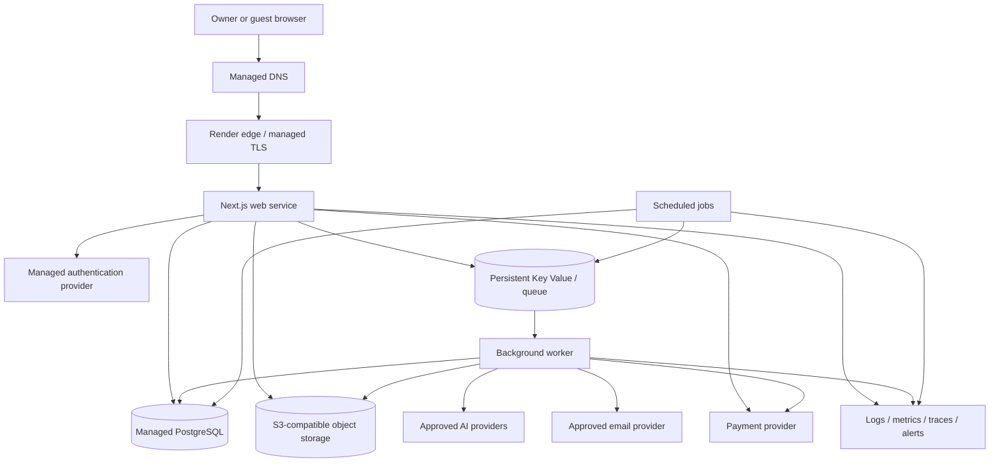

# Deployment Architecture

**File:** `docs/12_DEPLOYMENT.md`  
**Project:** AI Digital Invitation Platform  
**Status:** Approved — Owner Approved  
**Version:** 1.0  
**Approved date:** 2026-08-17  
**Depends on:** `docs/00_CLAUDE_RULES.md` through `docs/11_TESTING_STRATEGY.md`

---

## 1. Purpose

This document defines how the MVP is built, configured, released, hosted, monitored, backed up, restored, and operated.

It selects a provisional deployment baseline while preserving an evidence-based exit before production. It does not replace the dedicated payment, AI, security, database, or testing requirements.

---

## 2. Deployment goals

The deployment must:

1. support the approved Next.js modular monolith and separate durable worker;
2. keep PostgreSQL, queue, web, and worker traffic private where possible;
3. serve Mauritius well while remaining globally accessible;
4. deploy reproducibly from the private GitHub repository;
5. separate development, preview/CI, staging, and production;
6. protect secrets, personal data, payment state, AI assets, and backups;
7. support controlled migrations, rollback, reconciliation, and recovery;
8. provide useful logs, metrics, traces, alerts, and audit evidence;
9. scale without introducing Kubernetes or microservices in the MVP;
10. keep cost understandable and capped.

Security is established by layered controls and verified operation—not by the hosting brand alone.

---

## 3. Provisional MVP platform decision

### 3.1 Proposed baseline

Use **Render in its Singapore region** as the provisional primary application platform for the MVP:

- one paid Node.js web service for the Next.js application;
- one paid Node.js background worker for durable asynchronous work;
- one paid managed PostgreSQL database;
- one paid persistent Render Key Value instance for BullMQ-compatible delivery;
- scheduled jobs only for bounded maintenance and reconciliation;
- Render private networking between same-region services;
- a version-controlled Render Blueprint (`render.yaml`) as infrastructure-as-code.

Use a reviewed S3-compatible managed object-storage service for invitation assets and controlled exports. **Amazon S3 in Singapore** is the provisional baseline because it supports mature access controls, encryption, versioning/lifecycle features, and independent backup storage. The exact account configuration and current pricing require implementation-time verification.

Use managed DNS with DNSSEC support. Render-managed TLS terminates HTTPS at the application service. A separate CDN/WAF such as Cloudflare may be added only after its proxy, cache, webhook, IP attribution, privacy, and failure behavior are tested; it is not assumed by default.

### 3.2 Why one primary platform

Keeping the web service, worker, PostgreSQL, and queue in one region and private network reduces:

- cross-provider credentials and public network paths;
- deployment coordination;
- latency between synchronous application components;
- incident ambiguity;
- operational burden for an MVP team.

This is a pragmatic starting point, not permanent vendor lock-in. Application code remains portable Node.js/TypeScript, PostgreSQL remains ordinary PostgreSQL, provider integrations use adapters, and assets use a portable object-storage interface.

### 3.3 Production confirmation gate

Render Singapore is not approved for production merely because it is proposed here. Before paid customer launch, document and approve:

- measured latency from representative Mauritius mobile/fixed networks and at least one international market;
- provider contract, subprocessors, processing/storage location, and cross-border transfer safeguards;
- service availability and support terms for the selected plans;
- actual monthly cost at forecast load and safety margin;
- PostgreSQL version, HA, PITR window, connection limits, maintenance behavior, and restore test;
- Key Value persistence, memory, connection limits, and recovery behavior;
- object-storage region, versioning, encryption, lifecycle, CORS, and signed-URL behavior;
- payment/auth/AI provider connectivity from the region;
- operational access, MFA, audit, billing, and incident contacts.

If any mandatory requirement fails, evaluate **AWS Africa (Cape Town)** as the preferred controlled alternative using ECS/Fargate, RDS PostgreSQL, ElastiCache or an approved durable queue, S3, and managed edge/security services. AWS is a fallback because it offers a closer African region and deeper controls but materially increases infrastructure and operational complexity.

---

## 4. Runtime baseline

- **Application framework:** approved Next.js 16 App Router baseline.
- **Runtime:** Node.js 24 LTS, pinned to an exact supported patch in source configuration and deployment images.
- **Language:** strict TypeScript.
- **Package manager:** one repository-pinned manager and lockfile; proposed `pnpm` with Corepack after compatibility validation.
- **Application shape:** modular monolith, one web process, one separately scaled worker process.
- **Database:** PostgreSQL 18 if the selected managed plan and all required drivers/tooling support the exact version; otherwise PostgreSQL 17 as a documented temporary baseline with an upgrade plan.
- **Queue:** BullMQ-compatible Redis/Valkey interface, with PostgreSQL business state and outbox remaining authoritative.
- **Build output:** production Node deployment using a reproducible container or platform-native Node build. Evaluate Next.js standalone output during implementation.

Only Active LTS or Maintenance LTS Node releases may run in production. Runtime/framework upgrades require tests, staging, migration assessment, dependency review, and rollback evidence.

---

## 5. Logical deployment topology

Trust boundaries and provider payload rules from the approved architecture remain binding.

---

## 6. Service definitions

### 6.1 Web service

The web service handles:

- authenticated product routes;
- server-rendered public invitations;
- accountless RSVP routes;
- API/Server Action boundaries;
- provider callback and webhook ingress;
- health/readiness endpoints;
- enqueueing asynchronous work after durable database state exists.

It must not perform long-running AI generation, bulk email, large CSV processing, reconciliation, or retry loops inside the request lifecycle.

The public health endpoint reveals no secrets or dependency detail. A shallow liveness check proves the process can respond; an internal/deployment readiness check may perform a bounded database test without causing load amplification.

### 6.2 Worker

The worker handles:

- AI generation and controlled asset ingestion;
- transactional email delivery;
- payment verification/reconciliation tasks;
- CSV import processing when moved out of request scope;
- expiry, retention, cleanup, and projection work;
- outbox publication and idempotent retries.

The worker uses a separate least-privilege identity and database role. It handles `SIGTERM`, stops claiming work, completes or safely returns in-flight jobs within the shutdown window, and never acknowledges a job before its durable outcome is recorded.

### 6.3 Scheduled jobs

Cron jobs trigger bounded, idempotent commands. They do not become a second job queue. Required schedules include payment reconciliation, invitation expiry, retention cleanup, orphan detection, backup verification, and monitoring canaries as approved.

### 6.4 Local filesystem

Application service filesystems are ephemeral. Do not store uploads, generated invitation assets, exports, backups, or authoritative queue/database state on local disk. Temporary files are size-limited, cleaned promptly, and treated as disposable.

---

## 7. Region, latency, and global availability

Mauritius is the initial launch market; the product is not geographically restricted.

The MVP begins with one write region to preserve operational simplicity and transactional correctness. Web, worker, PostgreSQL, and Key Value must be co-located in the same Render region. No active-active database writes or cross-region queue are introduced.

Region selection is based on measured complete journeys—not geographic intuition alone. Test:

- invitation first view and factual-content availability;
- RSVP lookup and submission;
- owner authentication and dashboard;
- editor save and preview;
- checkout creation and provider return;
- upload and asset delivery;
- webhook/provider connectivity.

Static hashed assets and approved public images may use managed caching/CDN delivery. Authenticated HTML, RSVP tokens, payment responses, personalized data, and mutation responses must not be publicly cached.

If a future region migration is required, it is a planned data migration with DNS, object-storage, provider allow-list, webhook, backup, and rollback work. Render currently does not provide an in-place region switch, so portability must be maintained.

---

## 8. Environment model

### 8.1 Local development

- local/ephemeral services;
- disposable PostgreSQL matching production major version;
- provider fakes by default;
- no production credentials or data.

### 8.2 Pull-request CI

- isolated databases and test resources;
- synthetic data;
- provider fakes;
- no durable public environment unless a controlled preview is needed;
- automatic expiry of preview resources.

### 8.3 Staging

- separate Render environment/resources, database, Key Value, object bucket/prefix, domains, credentials, webhooks, and provider sandboxes;
- production-like service topology and configuration shape;
- synthetic data only;
- access restricted where practical;
- used for migrations, release-candidate tests, provider contracts, recovery, and rollback drills.

### 8.4 Production

- dedicated resources and least-privilege credentials;
- production provider accounts/endpoints only;
- protected manual promotion;
- non-destructive post-deploy smoke tests;
- monitored and backed up.

No environment shares signing secrets, payment merchant identifiers, database credentials, auth tenants, queue namespaces, storage write credentials, or AI keys. Environment names are visible in dashboards, logs, alerts, email subjects where safe, and resource names.

---

## 9. Repository and infrastructure-as-code

GitHub remains the source of truth.

The repository will contain:

- `render.yaml` or approved equivalent for non-secret infrastructure configuration;
- runtime/version declarations;
- lockfile;
- migration files;
- Dockerfiles only where the native build is insufficient;
- CI workflows;
- health/smoke/release scripts;
- operational runbooks and rollback instructions.

Infrastructure configuration never contains secret values. One resource is managed by only one infrastructure definition. Manual production changes are exceptional, recorded, reconciled back into source, and reviewed for drift.

Infrastructure deletion remains a separate explicitly approved action; removing a declaration from source must not silently destroy data.

---

## 10. CI/CD pipeline

### 10.1 Pull request

1. install from the immutable lockfile;
2. verify runtime and package-manager versions;
3. run static, test, security, schema, and build gates from Document 11;
4. generate a software bill of materials where supported;
5. publish non-sensitive test evidence;
6. prohibit deployment when required checks fail.

### 10.2 Main branch

Merging to `main` creates or identifies one immutable release artifact associated with:

- Git commit SHA;
- dependency lockfile;
- runtime image/version;
- Next.js build/deployment ID;
- migration set/checksum;
- build time and workflow identity.

Staging receives the candidate first. Production is not an automatic consequence of a merge.

### 10.3 Production promotion

Production deployment requires:

- protected GitHub environment or equivalent approval;
- passing release-candidate gates;
- reviewed migration classification;
- verified backup/recovery checkpoint for high-risk changes;
- maintenance/customer communication plan where needed;
- identified operator and rollback/forward-fix owner.

Build once and promote the same artifact where tooling supports it. If Render rebuilds per environment, builds must use the same commit, lockfile, exact runtime, immutable dependencies, and build identifier, and the limitation must be recorded.

Deploy hooks are secrets. Prefer a narrow deployment integration; if a hook is used, store it only in the protected CI secret store and rotate it on suspected disclosure.

---

## 11. Deployment sequence

For a normal compatible release:

1. validate infrastructure diff;
2. confirm database backup/recovery health;
3. apply backward-compatible expand migration using the dedicated migration identity;
4. deploy worker changes that understand old and new shapes where ordering requires it;
5. deploy web artifact;
6. wait for explicit health/readiness success;
7. run non-destructive smoke tests;
8. verify queues, outbox, webhooks, payment state, errors, latency, and alerts;
9. enable guarded features through server-side configuration/feature flags;
10. remove old schema only in a later verified release.

Migrations do not run implicitly on every web/worker startup. Only one authorized migration job applies them.

---

## 12. Database deployment

### 12.1 Version

Propose PostgreSQL 18 because it is the current supported major and Render documents in-place upgrades to it. Before provisioning, verify Drizzle, drivers, extensions, backup tooling, provider plan, and production features. If any critical dependency lacks support, use PostgreSQL 17 temporarily and record the upgrade trigger.

### 12.2 Connectivity

- use the private/internal database URL for same-region services;
- prohibit general public access;
- restrict any necessary administrative external access by allow-list/VPN/provider controls;
- require TLS wherever traffic can leave the private network;
- use separate migration, web-runtime, worker, read-only/reporting, and emergency roles where supported;
- runtime roles cannot alter schema;
- use bounded connection pools sized below provider limits with reserved operational capacity.

Do not multiply per-process pools until aggregate connection use is calculated across web instances, worker instances, deploy overlap, jobs, and administrative tools.

### 12.3 High availability

Production requires a paid database. Enable provider high availability when the selected plan and launch risk justify it; at minimum it must be priced and explicitly accepted or deferred before launch. A standby does not replace backup or restore testing.

---

## 13. Queue deployment

Use a paid Key Value instance in the same region with:

- internal authentication enabled;
- TLS/authenticated URL as supported;
- `noeviction` for job-queue correctness;
- Journal + Snapshot persistence;
- memory and connection alerts;
- separate namespaces/prefixes by environment;
- queue depth, oldest-job age, failure, retry, stall, and dead-letter monitoring.

Render documents that Journal + Snapshot persistence writes the append-only journal approximately once per second, so up to roughly one second of queue writes may be lost during a failure. The transactional PostgreSQL outbox and authoritative job records must detect and re-enqueue missing work. Queue payloads contain identifiers and minimized data only.

The queue is not the source of truth for payment success, entitlement, publication, RSVP, or AI usage.

---

## 14. Object storage and media delivery

Production object storage must provide:

- private-by-default buckets;
- provider-managed encryption at rest;
- TLS in transit;
- separate staging and production storage;
- least-privilege web/worker identities;
- signed time-limited access where private delivery is required;
- controlled public delivery only for published safe assets;
- versioning or equivalent recovery for protected source assets;
- lifecycle rules for temporary, abandoned, superseded, expired, and deleted assets;
- CORS limited to approved origins/actions;
- MIME, size, dimension, metadata, and malware/content validation before promotion;
- access logging/monitoring where practical;
- cost/bandwidth alerts.

Generated AI provider URLs are copied promptly into platform-controlled storage. Object keys are random/non-sensitive; filenames and bucket paths must not disclose guest names, emails, tokens, beliefs, or event secrets.

Public invitation facts remain semantic application data, not embedded only in an image.

---

## 15. DNS, domains, TLS, and ingress

- Register the production domain in a business-controlled registrar account with MFA, recovery controls, auto-renewal, and named owners.
- Use managed DNS with MFA and DNSSEC where supported.
- Use separate production and staging hostnames.
- Render automatically provisions/renews TLS for verified custom domains and redirects HTTP to HTTPS; verify issuance, renewal alerts, and domain validation before launch.
- Disable the default `onrender.com` production subdomain after the custom domain is stable unless it is required for health/recovery and protected appropriately.
- Configure security headers and HSTS only after HTTPS behavior is stable.
- Normalize trusted proxy headers and never trust arbitrary client-supplied forwarding headers for IP/security logic.
- Webhook paths have narrow methods, body limits, rate limits, signature verification, replay protection, and environment-specific URLs.

If a CDN/WAF proxy is introduced, verify cache keys, cookies, authorization headers, IP attribution, request-body limits, streaming, image behavior, RSVP/payment exclusions, webhook bypass/rules, TLS mode, logging, and outage fallback.

---

## 16. Next.js self-hosting rules

The current official Next.js guidance requires special care when self-hosting:

- keep a reverse proxy/managed ingress in front of the Node server;
- use a stable deployment ID derived from the release/commit;
- ensure every instance of the same release uses the same Server Actions encryption key/build output;
- handle `SIGTERM` and graceful shutdown;
- never rely on ephemeral local cache or disk as authoritative storage;
- treat authenticated/dynamic responses as non-public-cacheable;
- verify streaming and proxy buffering behavior;
- use a shared cache/tag-invalidation design before scaling web instances if cached public pages require consistent revalidation;
- preserve version-skew protection during rolling deployments.

For the first single web instance, avoid unnecessary distributed caching. Before horizontal scaling, implement and test shared cache coordination or explicitly make affected routes dynamic/no-store.

---

## 17. Secrets and configuration

Secrets live only in approved environment/secret stores. They never appear in Git, Blueprint values, images, client bundles, logs, traces, analytics, screenshots, fixtures, or documentation examples.

Required practices:

- separate secrets per environment and provider;
- least-privilege, workload-specific credentials;
- no broad personal access keys when a service identity is available;
- review every `NEXT_PUBLIC_*` value because it is bundled for browsers;
- validate required configuration at startup without printing values;
- rotation procedure and ownership for auth, database, queue, object storage, AI, email, payment, webhook, observability, deployment, and encryption keys;
- immediate revocation path;
- dual-key/overlap strategy where providers support safe rotation;
- record only secret names, owners, scope, creation/rotation date, and expiry—not values—in the inventory.

Local `.env` files are ignored by Git. `.env.example` contains names and safe explanations only.

---

## 18. Feature flags and operational controls

Use server-controlled configuration or a simple database-backed flag mechanism for high-risk features. Do not add a dedicated commercial flag platform by default.

Kill switches must exist for:

- new checkout creation;
- each unverified payment method;
- publication;
- AI text and image generation separately;
- outbound email;
- CSV import;
- RSVP mutation when abuse/incident containment requires it.

Flags cannot grant unauthorized entitlements or bypass payment/security checks. Changes are authenticated, audited, environment-scoped, reversible, and visible to responders.

---

## 19. Observability

Use structured JSON logs from web, worker, jobs, and migrations with timestamp, environment, service, release SHA, severity, stable event/error code, and correlation ID.

Proposed observability combination:

- Render service/deploy/database/queue metrics and logs;
- **Sentry** or a selected equivalent for application errors, performance traces, and release correlation after privacy/security review;
- an independent uptime/synthetic monitor for public invitation, RSVP availability, and authenticated canaries;
- business/operational dashboards sourced from safe aggregates and authoritative database state.

Monitor at least:

- request rate, latency, error, saturation, restarts, health failures, and deploy failures;
- database CPU, storage, connections, slow queries, locks, backup/PITR health, and replication/HA status;
- queue depth, oldest age, retry, stall, dead letter, memory, and connection use;
- worker throughput and shutdown/interrupted jobs;
- AI latency/failure/schema/cost/usage;
- payment verification delay, duplicates, mismatches, reconciliation gaps, and webhook failures;
- email failure/bounce where available;
- object-storage error, unexpected public access, and bandwidth/cost;
- authorization denials, abuse limits, admin/MFA anomalies, and secret/config failures;
- invitation publication, expiry, RSVP availability, and public rendering.

Logs exclude raw card/banking/authentication data, secrets, management tokens, full RSVP tokens, unnecessary personal data, unrestricted prompts/provider output, and signed URLs. Retention is documented and minimized.

---

## 20. Alerting and incident response

Alerts are actionable, severity-based, deduplicated, and routed to named responders. Production must not rely on a dashboard that nobody watches.

Initial severity targets:

- **P1:** suspected compromise, incorrect charge/entitlement, material privacy breach, database corruption/unavailability, widespread publication/RSVP failure;
- **P2:** serious degraded critical journey, growing queue/reconciliation backlog, backup failure, provider outage without safe recovery;
- **P3:** limited degradation or capacity trend requiring planned action.

Every P1/P2 alert links to a runbook with triage, containment, kill switch, rollback/forward-fix, provider escalation, evidence preservation, communication, recovery, and post-incident steps.

At least two independent notification paths are configured for P1 where commercially practical. Alert tests and on-call contacts are verified before launch.

---

## 21. Backup policy

### 21.1 PostgreSQL

Production requires provider PITR on a paid database. Proposed policy:

- continuous provider PITR with at least the plan-supported seven-day window;
- daily encrypted logical backup to a separately controlled object-storage location;
- 30 daily logical backups and 12 monthly backups initially, subject to privacy/tax/legal retention approval;
- deletion protection and restricted backup identities;
- automated success/failure monitoring;
- monthly isolated restore test before launch and during early operation, later adjusted by evidence but no less than quarterly;
- record restore duration, selected recovery point, integrity checks, application smoke results, and remediation.

Logical backup tools must be patched and compatible with the server version. Backups are classified like production data and must not be copied to developer machines.

### 21.2 Object storage

- enable versioning or equivalent recovery for owner uploads and canonical generated assets;
- lifecycle noncurrent versions and deleted data according to retention policy;
- maintain inventory/reference integrity between PostgreSQL and objects;
- test recovery of representative assets;
- do not assume the AI provider can recreate an identical asset.

### 21.3 Queue

Queue persistence supports transient recovery, not business backup. PostgreSQL outbox/job records rebuild required work.

---

## 22. Recovery objectives

Proposed MVP targets:

| System/data | RPO | RTO | Recovery basis |
|---|---:|---:|---|
| PostgreSQL authoritative data | 15 minutes maximum | 4 hours | PITR plus isolated restore/cutover |
| Payment/entitlement state | no accepted logical loss | 4 hours | provider reconciliation plus idempotent ledger repair |
| Object assets | 24 hours maximum for recoverable versions; no silent broken references | 8 hours | object versioning/backup and integrity inventory |
| Queue delivery | approximately 1 second infrastructure loss tolerated | 1 hour to resume; backlog time tracked | persistent queue plus PostgreSQL outbox re-enqueue |
| Web/worker release | last known good release | 1 hour | artifact/config rollback or forward fix |

RPO measures tolerated data loss; RTO measures restoration of the agreed service. These are operational targets, not public contractual promises. Validate them through drills and revise if actual recovery cannot meet them.

Payment records require reconciliation even when the general database recovery point is earlier. Never infer a payment solely from a browser return or amount match.

---

## 23. Disaster recovery

Document and exercise:

- accidental data deletion/corrupt migration;
- compromised application or provider credential;
- destructive administrator/repository action;
- Render regional/platform outage;
- PostgreSQL or Key Value failure;
- object-storage deletion/exposure;
- DNS/domain compromise;
- payment, AI, auth, or email provider outage;
- lost deploy access or owner account;
- ransomware or poisoned backup scenario.

The single-region MVP uses restore-and-redeploy disaster recovery rather than active-active infrastructure. Maintain enough source, infrastructure definition, secrets inventory/rotation process, backups, domain control, provider contacts, and runbooks to rebuild in an approved alternate region/provider.

An alternate-provider recovery is not claimed to meet the four-hour RTO until it has been rehearsed. Provider outage behavior may temporarily disable new checkout, AI, publication, or RSVP mutation while preserving safe public information and recovery messaging.

---

## 24. Rollback and forward-fix

Application releases use the last known good immutable commit/artifact. Rollback must not disable authorization, webhook verification, security headers, audit, or migration protections.

Database changes follow expand/migrate/contract:

1. add backward-compatible structures;
2. deploy dual-compatible code;
3. migrate/backfill in bounded resumable jobs;
4. switch reads/writes after verification;
5. remove old structures in a later release.

Destructive migrations require explicit approval and restore checkpoint. When old code is incompatible with migrated data, use a forward fix rather than pretending application rollback is safe.

Feature flags/kill switches are containment tools, not a substitute for reverting defective code or repairing data.

---

## 25. Scaling policy

Scale from measured bottlenecks:

1. optimize queries, indexes, payloads, images, and cache policy;
2. vertically size the web, worker, database, and queue within safe limits;
3. adjust worker concurrency per provider/database limits;
4. add web/worker instances only after idempotency, graceful shutdown, connection pools, Next.js cache coordination, and queue concurrency are tested;
5. add database HA/read replicas only for established reliability/read needs;
6. consider platform migration or additional regions only after evidence.

Autoscaling must respect payment/AI provider limits and cost ceilings. Kubernetes, service mesh, active-active databases, and multi-region writes remain excluded from MVP.

---

## 26. Cost management

Before production, create a monthly cost model for:

- Render workspace, web, worker, cron, PostgreSQL, HA/PITR, Key Value, build minutes, bandwidth, and support;
- object storage, requests, egress, versioning, lifecycle, and backups;
- DNS/domain, monitoring, error tracking, email, auth, payment, and AI;
- staging minimums and recovery tests;
- tax/foreign-exchange treatment of provider invoices.

Use tagged/named resources and provider budgets where available. Alert at proposed 50%, 75%, 90%, and 100% of the owner-approved monthly operating budget. Cost alerts do not automatically shut down payment verification, RSVP, or other critical state-changing workflows. AI generation and other discretionary cost centers have explicit quotas/kill switches.

Free tiers are not acceptable for production database, queue, web, worker, backup, or monitoring dependencies when they sleep, lack recovery, have unsuitable limits, or provide no operational assurance.

---

## 27. Maintenance and upgrades

- Subscribe to security, deprecation, incident, and maintenance notifications for every provider.
- Patch critical vulnerabilities within the approved security SLA.
- Review Node, Next.js, PostgreSQL, operating image, dependencies, browsers, provider SDKs, and model/API versions monthly and before release.
- Test PostgreSQL major upgrades on a clone/restored database first.
- Schedule provider maintenance with customer impact and payment/worker queues considered.
- Rotate secrets and exercise emergency revocation.
- Review unused resources, access, backup retention, logs, cost, and drift monthly.
- Re-evaluate region/provider annually or after material incident, growth, legal change, or feature need.

Exact versions remain pinned and recorded; “latest” is never a production deployment policy.

---

## 28. Production readiness checklist

Production launch is blocked until:

- owner decisions in this document are approved;
- latency and load tests pass from Mauritius and representative international access;
- data protection/legal transfer/provider review is complete;
- production plans and cost ceiling are approved;
- domain, DNS, TLS, MFA, recovery owners, and billing alerts are verified;
- environment separation and least-privilege identities are tested;
- production database/queue/storage are paid, persistent, encrypted, monitored, and access-controlled;
- migrations and connection budgets are verified;
- PITR and independent logical backup succeed;
- isolated database and representative asset restore meet accepted objectives;
- release, rollback/forward-fix, and provider outage drills pass;
- payment production readiness and reconciliation pass;
- AI/email/auth/storage contracts and regional behavior pass;
- observability, P1/P2 alerts, runbooks, and contacts are live;
- independent security assessment has no unresolved Critical/High launch blockers;
- WCAG, performance, device, and critical E2E gates pass;
- privacy, terms, support, incident, and customer communication procedures are ready;
- owner explicitly authorizes launch.

---

## 29. Explicit MVP exclusions

- Kubernetes or managed Kubernetes;
- microservices/service mesh;
- multi-region active-active writes;
- automatic cross-cloud failover claims;
- self-managed PostgreSQL, Redis/Valkey, object storage, or TLS;
- production services on sleeping/free tiers;
- direct internet exposure of PostgreSQL or queue;
- stateful application disks as authoritative storage;
- automatic production deployment on every `main` push;
- unreviewed infrastructure changes from dashboards;
- production data copied into development/CI;
- unlimited autoscaling or uncapped AI/provider spend;
- public SLA promises before measured operational history;
- a CDN/WAF configuration that caches personalized, RSVP, payment, or authenticated responses.

---

## 30. Current-source notes

Official/current sources reviewed on 2026-08-17:

- Render regions: <https://render.com/docs/regions>
- Render background workers: <https://render.com/docs/background-workers>
- Render private networking: <https://render.com/docs/private-network>
- Render Key Value persistence and queue policy: <https://render.com/docs/key-value>
- Render PostgreSQL backups and PITR: <https://render.com/docs/postgresql-backups>
- Render PostgreSQL upgrades: <https://render.com/docs/postgresql-upgrading>
- Render health checks: <https://render.com/docs/health-checks>
- Render deployments: <https://render.com/docs/deploys>
- Render Blueprints infrastructure-as-code: <https://render.com/docs/infrastructure-as-code>
- Render custom domains and TLS: <https://render.com/docs/custom-domains>
- Next.js self-hosting: <https://nextjs.org/docs/app/guides/self-hosting>
- Next.js deployment platform requirements: <https://nextjs.org/docs/app/guides/deploying-to-platforms>
- Node.js release lifecycle: <https://nodejs.org/en/about/previous-releases>
- AWS ECS/Fargate regions: <https://docs.aws.amazon.com/AmazonECS/latest/developerguide/AWS_Fargate-Regions.html>
- AWS RDS PostgreSQL regional availability: <https://docs.aws.amazon.com/AmazonRDS/latest/UserGuide/Concepts.RDS_Fea_Regions_DB-eng.Feature.MultiAZDBClusters.html>

Provider features, regions, versions, pricing, plan limits, availability commitments, subprocessors, and legal terms may change. Recheck the exact official sources during implementation, procurement, and production readiness.

---

## 31. Approved owner decisions

### Decision 1 — Primary MVP platform

**Approved:** Use Render as the provisional managed platform for the Next.js web service, continuous worker, PostgreSQL, Key Value queue, and scheduled jobs, subject to the production confirmation gate.

### Decision 2 — Primary region

**Approved:** Start staging evaluation in Render Singapore with all stateful/application services co-located. Approve production only after Mauritius and international latency tests plus transfer/legal review.

### Decision 3 — Alternate platform gate

**Approved:** If Render fails mandatory latency, residency, contractual, recovery, support, or cost requirements, evaluate AWS Africa (Cape Town) as the preferred fallback rather than weakening the requirements.

### Decision 4 — Object storage

**Approved:** Use private-by-default Amazon S3 in Singapore as the provisional object-storage baseline, with encryption, versioning/lifecycle, least privilege, signed URLs, and separate environments; retain an S3-compatible adapter.

### Decision 5 — Database version

**Approved:** Use PostgreSQL 18 if the selected Render plan, Drizzle, drivers, extensions, and backup tooling pass compatibility tests; otherwise use PostgreSQL 17 temporarily with a recorded upgrade plan.

### Decision 6 — Queue durability

**Approved:** Use a paid same-region Render Key Value instance with internal authentication, `noeviction`, and Journal + Snapshot persistence. Treat PostgreSQL outbox/job records as recovery authority for possible queue loss.

### Decision 7 — Deployment control

**Approved:** Run all required CI gates on pull requests and `main`, deploy candidates to staging first, and require protected manual approval for production. A merge alone never launches production.

### Decision 8 — Infrastructure-as-code

**Approved:** Store non-secret Render infrastructure in one reviewed `render.yaml` Blueprint and reconcile exceptional dashboard changes back into Git.

### Decision 9 — Runtime

**Approved:** Use Node.js 24 LTS pinned to an exact supported patch and one locked package manager. Upgrade only through tested, staged, reversible changes.

### Decision 10 — Recovery objectives

**Approved:** Adopt an initial PostgreSQL RPO of no more than 15 minutes and RTO of four hours; reconcile payment/entitlement state to avoid accepted logical loss. Use the system-specific targets in Section 22 and validate them through drills.

### Decision 11 — Backup policy

**Approved:** Require provider PITR, daily independently stored encrypted logical backups, initial 30-daily/12-monthly retention subject to legal review, versioned canonical assets, and monthly restore tests during launch/early operation.

### Decision 12 — Database high availability

**Approved:** Price and evaluate Render PostgreSQL HA before launch. Enable it if affordable and supported by the selected production plan; any deferral must be an explicit documented reliability risk acceptance and does not waive backup/restore requirements.

### Decision 13 — Observability

**Approved:** Combine Render telemetry, a privacy-reviewed Sentry deployment or equivalent, an independent uptime/synthetic monitor, and authoritative business/reconciliation dashboards. Do not place sensitive payloads in telemetry.

### Decision 14 — CDN/WAF

**Approved:** Begin with Render-managed ingress/TLS and managed DNS. Add Cloudflare or another CDN/WAF only after cache, webhook, proxy-IP, privacy, streaming, and failure-mode tests; never cache authenticated, RSVP-token, payment, or personalized responses publicly.

### Decision 15 — Production capacity and cost

**Approved:** Use paid non-sleeping production services, approve a monthly cost model and ceiling before launch, alert at 50/75/90/100%, and use explicit quotas/kill switches for discretionary AI cost without disabling payment verification or RSVP integrity.

### Decision 16 — Single-region MVP

**Approved:** Operate a single write region with restore-and-redeploy disaster recovery for MVP. Defer active-active/multi-region writes and make no automatic cross-cloud failover promise.

### Decision 17 — Scaling

**Approved:** Begin with one production web instance and one worker instance sized from testing, then scale vertically and optimize before horizontal scaling. Require connection-budget, idempotency, graceful-shutdown, and Next.js cache-coordination tests before adding instances.

### Decision 18 — Kubernetes

**Approved:** Keep Kubernetes, service mesh, and self-managed infrastructure excluded from MVP. Managed services and tested controls provide the required security without introducing orchestration complexity.

---

## 32. Approval record

**Status:** Approved — Owner Approved.  
**Approved version:** 1.0.  
**Approved date:** 2026-08-17.  
**Owner decisions:** Decisions 1–18 approved as proposed.
