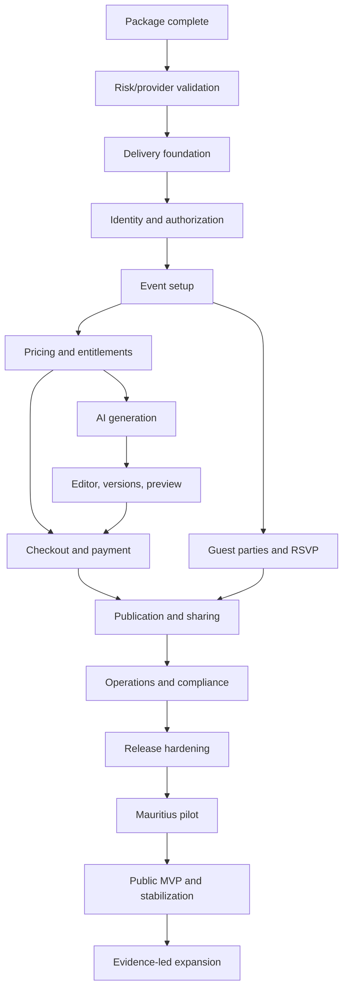

# Product and Delivery Roadmap

**File:** `docs/13_ROADMAP.md`  
**Project:** AI Digital Invitation Platform  
**Status:** Approved — Owner Approved  
**Version:** 1.0  
**Approved date:** 2026-08-17  
**Depends on:** `docs/00_CLAUDE_RULES.md` through `docs/12_DEPLOYMENT.md`

---

## 1. Purpose

This roadmap converts the approved product and architecture into a safe implementation sequence for Claude Code and human reviewers.

It defines outcomes, dependencies, entry/exit gates, and launch stages. It is not a promise that every listed item will ship on a fixed calendar date. Dates and effort forecasts become credible only after provider onboarding, team capacity, legal/commercial reviews, and the first measured implementation slices.

---

## 2. Roadmap principles

### 2.1 Build in vertical slices

Each slice should produce a testable user or operational outcome across UI, domain logic, persistence, authorization, observability, and documentation. Avoid building all database tables, then all APIs, then all screens as disconnected layers.

### 2.2 Respect dependencies

Payment cannot grant entitlements before orders, ledgers, verification, and reconciliation exist. Publishing cannot precede immutable invitation versions and verified payment. Public RSVP cannot precede strict projections, guest-party authorization, abuse controls, and privacy review.

### 2.3 Keep work in progress small

Claude Code completes, tests, reviews, and records one bounded task before starting another. Partially implemented critical paths create false confidence.

### 2.4 Prove risky assumptions early

The earliest spikes validate:

- deployment latency from Mauritius;
- payment provider/acquirer eligibility and supported methods;
- managed authentication fit;
- AI output quality/cost/latency;
- invitation rendering on mobile;
- accountless RSVP privacy and usability;
- database/queue recovery behavior.

Spikes produce decisions and disposable prototypes—not unreviewed production shortcuts.

### 2.5 Launch narrowly, then expand

The MVP fully supports weddings only. Mauritius is the first operational market, while public access remains global. Expansion in event types, languages, currencies, payment methods, and regions follows evidence and approved rules.

### 2.6 Quality gates are roadmap work

Security, accessibility, localization, testing, monitoring, backup, recovery, reconciliation, and support are deliverables in every phase, not a final cleanup sprint.

---

## 3. Roadmap status model

Every phase and tracked task uses one status:

- **Proposed:** not yet approved for implementation;
- **Ready:** dependencies and acceptance criteria are complete;
- **In progress:** actively being implemented;
- **Blocked:** cannot proceed; blocker and owner recorded;
- **In review:** implementation complete, evidence under review;
- **Done:** acceptance criteria and required evidence approved;
- **Deferred:** deliberately outside the current delivery horizon;
- **Cancelled:** no longer planned, with reason recorded.

“Done” means code, tests, security/accessibility implications, operational evidence, and relevant documentation are complete. A merged stub, placeholder, mocked critical integration, or hidden failing test is not Done.

---

## 4. Planning levels

### Horizon A — Claude Code package completion

Complete the authoritative documentation and repository control files before production implementation begins.

### Horizon B — MVP foundation and vertical slices

Build the smallest complete wedding invitation product that reaches verified payment, publication, sharing, and RSVP safely.

### Horizon C — Launch readiness and Mauritius pilot

Validate real providers, operations, legal obligations, accessibility, performance, recovery, and support with controlled users.

### Horizon D — Public MVP launch and stabilization

Open the service gradually, observe real behavior, repair defects, and validate the business model.

### Horizon E — Evidence-led expansion

Add event types, languages, commercial options, and advanced features only after MVP evidence and explicit approval.

---

## 5. Phase 0 — Complete the Claude Code package

### Outcome

The repository contains one consistent, approved source of truth from which implementation tasks can be generated.

### Scope

After approval of this roadmap, create and approve sequentially:

```text
product/PRICING_RULES.md
product/ENTITLEMENTS.md
product/AI_USAGE_RULES.md
product/GUEST_RULES.md
product/LOCALIZATION.md

project/CURRENT_STATE.md
project/TASKS.md
project/BACKLOG.md
project/DECISIONS.md
project/CHANGELOG.md

CLAUDE.md
README.md
.gitignore
.env.example
```

Also verify that Documents 00–13 use consistent terminology, statuses, provider decisions, MVP scope, and owner approvals.

### Exit gate

- every required package file exists and is approved;
- `CLAUDE.md` tells Claude Code how to read and obey the package;
- `CURRENT_STATE.md` accurately states that implementation has not yet begun;
- `TASKS.md` contains only ready, bounded work;
- unresolved decisions are visible and do not masquerade as approved facts;
- secrets and real credentials are absent;
- the repository structure and links are validated.

No application implementation begins before this phase is approved complete.

---

## 6. Phase 1 — Technical and commercial validation

### Outcome

The highest-risk external assumptions are tested before the application depends on them.

### Workstreams

#### Deployment spike

- provision disposable Render Singapore services matching the proposed topology;
- measure Mauritius and representative international latency;
- verify Next.js 16, Node.js 24 LTS, PostgreSQL version, worker shutdown, private networking, queue persistence, health checks, deploy/rollback, and object storage;
- estimate production and staging costs;
- decide whether Render passes or AWS Cape Town evaluation is required.

#### Payment procurement

- obtain official merchant/onboarding information from MIPS and Peach Payments or other approved candidates;
- confirm Mauritius merchant eligibility, contracts, fees, settlement, MUR/EUR/USD, refunds, disputes, sandbox, webhooks, support, and production methods;
- verify Visa, Mastercard, MCB Juice, MauCAS QR/SBM Tag compatibility and blink only where officially supported;
- select one primary MVP provider and record why;
- do not advertise any unverified method.

#### Authentication evaluation

- evaluate managed providers against secure sessions, MFA for admin/support, recovery, environment separation, data processing, pricing, exportability, and Next.js integration;
- select and document the provider before implementing identity-bound data.

#### AI evaluation

- run the approved multilingual synthetic evaluation set against candidate pinned OpenAI text and Replicate image models;
- measure factual fidelity, structure, latency, cultural safety, moderation, asset rights, retention, region, and cost;
- select exact initial model/version identifiers and budgets;
- verify there is no floating production alias or silent cross-provider failover.

#### Legal/accounting readiness plan

- identify qualified Mauritius legal/privacy and accounting/tax reviewers;
- map required decisions, evidence, owners, and deadlines;
- start DPO/controller/processor, cross-border transfer, privacy notice, terms, VAT, invoice, refund, and international checkout review.

### Exit gate

- mandatory provider choices are approved or a blocker prevents implementation;
- deployment baseline passes or fallback evaluation is authorized;
- cost ranges and usage constraints are documented;
- legal/accounting review work has named owners;
- spike code is discarded or explicitly promoted through normal review.

---

## 7. Phase 2 — Repository and delivery foundation

### Outcome

A deployable, testable, observable skeleton exists without pretending product features are complete.

### Scope

- initialize the approved monorepo/package structure;
- pin Node.js, package manager, Next.js, TypeScript, linting, formatting, and test tools;
- configure strict TypeScript and package boundaries;
- add CI checks, dependency/secret scanning, test reporting, and protected environments;
- create Render Blueprint/infrastructure definitions without secrets;
- provision isolated local, CI, staging, and production configuration shapes;
- implement configuration validation and secret inventory metadata;
- create web/worker processes with liveness/readiness and graceful shutdown;
- add structured logging, correlation IDs, release SHA, and basic monitoring;
- establish design tokens and foundational accessible components;
- create database migration tooling and an empty baseline migration;
- add architecture-decision and change-log workflow.

### Exit gate

- a clean checkout builds and tests reproducibly;
- staging deploys web and worker from an approved commit;
- no production credentials are present;
- health, logs, release identity, and rollback are demonstrated;
- test and security gates fail correctly on deliberate faults;
- no unnecessary business feature has been smuggled into foundation work.

---

## 8. Phase 3 — Identity, accounts, and authorization

### Outcome

An owner can securely create and use an account, while unauthorized access is denied and audited.

### Scope

- managed authentication integration;
- account/profile creation linked to stable external subject;
- secure sessions, logout, expiry, rotation, and recovery;
- admin/support MFA baseline and least-privilege roles;
- owner authorization policy and resource-scoping helpers;
- account settings and active-language preference;
- security/audit events without sensitive payloads;
- rate limits for login/recovery and account actions;
- cross-account and role-matrix tests.

### Exit gate

- authentication/recovery works in active MVP languages required for the tested flow;
- cross-account access tests fail closed;
- session and administrator controls meet the approved security baseline;
- production and staging auth tenants/credentials are separated;
- support cannot silently impersonate an owner.

---

## 9. Phase 4 — Event foundation and guided setup

### Outcome

An authenticated owner can create, view, edit, and safely manage one wedding event through the approved structured questionnaire.

### Scope

- event aggregate, ownership, lifecycle, timestamps, and audit;
- wedding-only event creation;
- eight-part design questionnaire and factual event details;
- venue/date/time/timezone/contact validation;
- explicit owner-selected language and cultural/religious context;
- draft autosave with conflict-safe behavior;
- event dashboard/progress model;
- public-safe projection boundaries established but not yet published;
- delete/retention behavior appropriate to draft data.

### Exit gate

- all core event invariants have database and domain tests;
- owner cannot access another owner’s event;
- cultural motifs are never inferred from identity/name/locale;
- long English, French, and Mauritian Kreol content works on mobile;
- incomplete drafts recover safely after interruption.

---

## 10. Phase 5 — Packages, pricing, and entitlements foundation

### Outcome

The system can show owner-approved packages and calculate an immutable server-side commercial offer without taking payment yet.

### Scope

- implement approved `PRICING_RULES.md` and `ENTITLEMENTS.md`;
- package catalogue/versioning;
- MUR base amounts and tax configuration hooks;
- EUR/USD disabled until provider/FX/tax/accounting approval;
- server-side quote/order draft with amount, currency, tax, rounding, and expiry;
- entitlement ledger/reservation model;
- truthful package comparison UI;
- administrative price activation controls and audit;
- tests for every monetary and entitlement invariant.

### Exit gate

- client values cannot change authoritative price/currency/tax;
- historical orders remain tied to their package/price version;
- no subscription behavior exists;
- no unlimited AI promise exists;
- unapproved currencies, taxes, methods, and packages are impossible to activate accidentally.

---

## 11. Phase 6 — AI concept generation

### Outcome

An entitled owner can request bounded, traceable text/image concepts through durable asynchronous jobs and receive safe normalized results.

### Scope

- approved AI provider adapters and exact model/version configuration;
- prompt templates and structured schema validation;
- input minimization, prompt-injection defenses, and moderation;
- usage reservation/debit/refund ledger;
- generation request/job lifecycle;
- worker retries, timeout, cancellation, idempotency, and dead letter;
- safe image ingestion into platform object storage;
- English, French, and Mauritian Kreol evaluation paths;
- owner-visible queued/processing/succeeded/failed states;
- provider/cost/quality monitoring and kill switches.

### Exit gate

- AI failure cannot corrupt the event or silently consume incorrect entitlement;
- factual names/dates/venues are validated and owner-confirmed;
- unrestricted raw provider output is not trusted or publicly rendered;
- no arbitrary code/external asset is introduced through AI;
- quality and cost meet the approved evaluation threshold;
- provider outage and replay recovery are demonstrated.

---

## 12. Phase 7 — Invitation editor, versions, and preview

### Outcome

The owner can refine a concept through controlled configuration, create immutable versions, and preview exactly what may later be published.

### Scope

- approved theme/token renderer;
- semantic factual content separated from decorative artwork;
- controlled typography, palette, motif, layout, and restrained motion;
- immutable invitation versions and active candidate selection;
- owner edits and approved bounded AI regeneration/tuning;
- responsive editor/preview;
- public-rendering projection in preview mode without public discoverability;
- visual, accessibility, localization, performance, and security tests;
- no arbitrary HTML/CSS/JavaScript or user-uploaded fonts.

### Exit gate

- saved version is immutable and reproducible;
- preview identifies the exact version and package implications;
- mobile factual content and RSVP placement remain usable before decoration;
- themes pass allow-list, contrast, cultural-selection, and reduced-motion rules;
- preview URLs do not become guessable public invitations.

---

## 13. Phase 8 — Checkout, verified payment, and entitlement grant

### Outcome

An owner can pay through the selected provider, return safely, receive server-verified entitlement, and recover from delayed or duplicate events.

### Scope

- one selected provider adapter and provider-controlled checkout;
- verified production-supported methods only;
- order freeze and checkout creation;
- webhook/callback signature verification, replay protection, and raw-body handling;
- browser return remains `verifying` until server confirmation;
- amount, currency, merchant, environment, and order verification;
- idempotent payment ledger and entitlement grant;
- failed/cancelled/expired/pending/refunded states;
- reconciliation queue, operational view, and alerts;
- safe receipt/invoice data according to professional review;
- checkout accessibility and localization.

### Exit gate

- forged browser success cannot publish or grant entitlement;
- duplicate/out-of-order webhooks cannot double grant;
- reconciliation accounts for every provider payment;
- raw card/CVV/PIN/banking credentials never enter application systems;
- sandbox and production credentials/endpoints cannot be mixed;
- payment/security test matrix and provider production checklist pass.

---

## 14. Phase 9 — Guest parties and accountless RSVP

### Outcome

An owner can manage guest parties and a guest can respond privately without creating an account.

### Scope

- guest-party-first domain and capacity rules;
- manual guest/party management;
- validated CSV import with downloadable safe error report;
- closed RSVP default;
- hard-to-guess public invitation slug plus separate private RSVP/management token where required;
- hashed tokens, expiry/revocation, replay/abuse controls, and non-disclosing errors;
- attendance, party member, dietary/accessibility, and owner-approved question fields only;
- RSVP revision history and latest-state projection;
- owner dashboard summaries without exposing other parties;
- mobile, keyboard, screen-reader, localization, privacy, and concurrency tests.

### Exit gate

- a guest needs no platform account;
- guessing does not reveal whether a person/party exists;
- one party cannot view/change another party;
- repeated/concurrent submission produces one consistent result and recorded revisions;
- no marketing consent is bundled;
- CSV formula/injection, encoding, size, duplicate, and invalid-row cases are safe.

---

## 15. Phase 10 — Publication, sharing, expiry, and lifecycle

### Outcome

A paid eligible invitation can be published, shared, rendered publicly, unpublished, and expired according to the package lifecycle.

### Scope

- publication eligibility state machine;
- first successful publication establishes hosting start;
- strict server-controlled public projection;
- public invitation route, metadata, Open Graph asset, and `noindex` policy;
- QR generation and validation;
- owner-assisted WhatsApp/social/email/direct-link sharing without unsupported platform automation;
- publish, unpublish, republish, suspend, and expire operations;
- factual changes create/select a new immutable version;
- expiry/closed RSVP messaging and safe owner recovery;
- cache invalidation/version-skew handling;
- public performance, abuse, accessibility, and availability monitoring.

### Exit gate

- unpaid/unverified/ineligible events cannot publish;
- public response contains only approved projection fields;
- first publication date and hosting interval are correct and cannot be reset by ordinary edits;
- unpublish/expire behavior propagates safely;
- QR and shared links resolve correctly on representative mobile devices;
- public invitation remains useful on slow networks and without decorative assets.

---

## 16. Phase 11 — Operations, administration, and compliance completion

### Outcome

The business can operate the MVP safely without uncontrolled database access or invisible failures.

### Scope

- least-privilege admin/support interface;
- payment reconciliation and exception handling;
- AI/job/dead-letter operational views;
- event suspension and abuse controls;
- audited feature/kill switches;
- customer support workflow and redacted diagnostics;
- data-subject request, retention, deletion/anonymization, and backup-aging procedure;
- refund/dispute operational procedure;
- privacy notice, terms, consent records, and legal/accounting approvals;
- monitoring dashboards, alerts, escalation, incident and recovery runbooks;
- cost budgets and alerts;
- access review, secret rotation, backup/restore, and provider-contact evidence.

### Exit gate

- routine support does not require direct production database edits;
- every privileged action is authenticated, authorized, and audited;
- legal/privacy/accounting launch blockers are signed off;
- incident, backup restore, credential revocation, payment reconciliation, and rollback drills pass;
- named people can respond to P1/P2 alerts.

---

## 17. Phase 12 — Release hardening

### Outcome

A release candidate meets the approved production launch gates.

### Scope

- full critical E2E suite and browser/device matrix;
- security review and independent penetration test/equivalent;
- WCAG 2.2 AA assessment with manual assistive-technology testing;
- English, French, and Mauritian Kreol content/flow review;
- Mauritius mobile-network and global-access performance tests;
- forecast capacity plus safety margin;
- payment production certification/readiness;
- AI quality/cost regression evaluation;
- migration, rollback/forward-fix, restore, disaster, and provider-outage exercises;
- monitoring/alert noise tuning;
- support documentation and pilot onboarding material;
- launch checklist evidence.

### Exit gate

- no unresolved known Critical/High defect or payment/security vulnerability;
- all mandatory release gates pass;
- provider production credentials and methods are verified;
- RPO/RTO evidence is accepted;
- cost ceiling and incident owners are approved;
- owner authorizes a controlled pilot—not unrestricted public launch.

---

## 18. Phase 13 — Controlled Mauritius pilot

### Outcome

Real customers complete a small number of weddings under close observation before broad availability.

### Pilot shape

- invite-only or tightly capped enrollment;
- Mauritius-first participants representing owner and planner use cases;
- real production payment only after provider/legal readiness;
- explicit support channel and rapid escalation;
- gradual activation of verified payment methods and AI limits;
- daily reconciliation and operational review during the initial window;
- consented feedback without exposing guest data;
- no unapproved experimental feature on live events.

### Measure

- event setup and preview completion;
- AI concept acceptance/regeneration/failure/cost;
- checkout conversion, verification delay, failure, refund, and discrepancy;
- publication success and invitation performance;
- CSV/guest-party usability;
- RSVP completion, revision, and support issues;
- accessibility/language issues;
- support volume and time to resolution;
- reliability, queue age, errors, alerts, and recovery;
- gross revenue, provider cost, AI cost, infrastructure cost, and refund rate.

### Exit gate

- pilot events complete without unresolved systemic Critical/High issue;
- all payments reconcile;
- owner and guest critical journeys meet accepted reliability/usability;
- unit economics and support burden are understood;
- defects and feedback are triaged;
- owner explicitly approves broader launch or extends the pilot.

---

## 19. Phase 14 — Public MVP launch and stabilization

### Outcome

The wedding MVP becomes publicly purchasable while operational risk remains controlled.

### Launch approach

- increase traffic/customer caps gradually;
- preserve kill switches and provider quotas;
- monitor critical journeys and costs closely;
- reconcile payments daily at minimum during early launch;
- review support, security, accessibility, AI quality, and provider performance frequently;
- prioritize production defects over new features;
- publish only capabilities, methods, currencies, and languages that are actually verified.

### Stabilization exit

- multiple complete event lifecycles have finished, including expiry/refund/support cases where available;
- reliability, recovery, cost, and support metrics are stable enough for normal operations;
- no recurring critical reconciliation, authorization, RSVP, or AI-accounting defect;
- roadmap evidence supports or rejects the next expansion.

---

## 20. Post-MVP expansion candidates

These are candidates, not commitments. Re-prioritize using customer evidence, risk, revenue, accessibility, and operational cost.

### Near-term candidates

- refine wedding packages and limits using measured unit economics;
- additional verified Mauritian payment methods;
- EUR/USD checkout after provider, FX, settlement, accounting, refund, and tax approval;
- stronger planner workflows and delegated collaboration;
- improved RSVP questions and exports within privacy limits;
- additional reviewed wedding themes/motifs;
- improved analytics based on privacy-safe aggregates;
- operational automation that preserves approvals and audit.

### Later candidates

- engagements and anniversaries;
- birthdays, baby showers, religious ceremonies, graduations, corporate events, and private parties;
- Russian interface localization;
- additional markets/currencies/tax regimes;
- advanced planner/team accounts;
- white-label offering;
- template marketplace;
- deeper messaging integrations;
- advanced invitation effects only if performance/accessibility remain acceptable;
- provider diversification after demonstrated need.

Every new event type receives its own domain/content/legal/cultural requirements; it is not enabled by renaming “wedding.”

---

## 21. Explicitly deferred or rejected

The roadmap does not schedule these for MVP:

- subscriptions;
- advertisements on guest pages;
- arbitrary custom HTML/CSS/JavaScript;
- AI-generated executable invitation code;
- unlimited AI usage;
- silent AI-provider failover;
- public API;
- native mobile applications;
- real-time collaborative editor;
- complex drag-and-drop page builder;
- marketplace/community themes;
- user-uploaded fonts;
- autoplay music/video;
- 3D, parallax, and particle-heavy invitations;
- per-guest AI copy;
- Russian interface;
- non-wedding events;
- microservices, Kubernetes, service mesh, and active-active multi-region databases;
- direct integration with every local wallet;
- international currency/tax behavior before professional and provider approval.

Deferred work enters the backlog only with a stated problem/evidence, not because it appeared in the original concept.

---

## 22. Dependency map



Some implementation may overlap when dependencies and review capacity permit, but no downstream release gate is waived.

---

## 23. Workstream ownership

The same person may hold several roles in a small team, but responsibilities remain explicit:

| Workstream | Accountable role |
|---|---|
| Product scope, pricing, launch, exceptions | Owner |
| Architecture and implementation integrity | Technical lead |
| Privacy/legal/terms/transfers | Qualified Mauritius legal/privacy reviewer plus owner |
| Tax, invoices, settlement, refunds | Qualified Mauritius accountant/tax reviewer plus owner |
| Payment onboarding/reconciliation | Owner/operations with technical lead |
| Security controls and incident readiness | Technical/security owner |
| Accessibility and design acceptance | Product/design owner with qualified testing support |
| Localization and cultural review | Competent language/cultural reviewers |
| Deployment, backup, monitoring, recovery | Technical/operations owner |
| Customer support and pilot operations | Named support/operations owner |

Claude Code may implement and prepare evidence; it cannot provide legal/tax sign-off, merchant approval, penetration-test independence, or owner launch authorization.

---

## 24. Claude Code execution protocol

For each implementation task, Claude Code must:

1. read `CLAUDE.md`, `project/CURRENT_STATE.md`, `project/TASKS.md`, and all relevant approved documents;
2. restate the bounded outcome, dependencies, files likely affected, and acceptance evidence;
3. identify contradictions or missing owner decisions before coding;
4. create the smallest complete change;
5. add/update tests at the correct layers;
6. run required checks and report actual results;
7. review security, privacy, accessibility, localization, payment, AI, data, and operational impact as applicable;
8. update project state, decisions, task status, and changelog only when authorized;
9. stop at the task boundary;
10. never mark a phase or feature Done without its exit evidence.

Claude Code must not implement an entire phase from one broad prompt. Phases are decomposed into reviewable tasks in `project/TASKS.md`.

---

## 25. Task readiness standard

A task is Ready only when it has:

- one clear outcome;
- linked approved requirements/decisions;
- explicit in-scope and out-of-scope boundaries;
- dependencies satisfied;
- acceptance criteria including failure/security/accessibility cases;
- expected test layers;
- migration/rollback/observability implications where relevant;
- no unresolved owner/provider/legal decision required to implement it correctly.

Research spikes define a question, evidence source, time/effort bound, and decision output. They do not quietly become production implementation.

---

## 26. Progress measurement

Do not report progress as percentage of code written. Report:

- phases whose exit gates are met;
- critical journeys proven end-to-end;
- Ready/In progress/Blocked/Done tasks;
- unresolved owner/provider/legal decisions;
- Critical/High defects and security findings;
- test/recovery/reconciliation evidence;
- pilot outcomes and unit economics;
- current operational risk.

Burn-up/burndown charts may assist delivery management but cannot redefine incomplete quality gates as completed scope.

---

## 27. Timeline and estimation policy

This roadmap deliberately avoids a fixed launch date in version 0.1.

After Phase 1 and the first two implementation slices, estimate each remaining phase using:

- actual team capacity and review availability;
- provider onboarding/merchant approval lead time;
- legal/accounting review timelines;
- measured cycle time and defect/rework rate;
- infrastructure and testing effort;
- contingency for integration and production-readiness work.

Use ranges and confidence levels. Separate engineering effort from external waiting time. Reforecast at each phase gate. Never trade payment correctness, security, privacy, accessibility, backup, or recovery for an arbitrary date.

---

## 28. Roadmap change control

A roadmap change must record:

- requested change and reason;
- evidence/customer/business need;
- affected approved documents and decisions;
- dependency, security, privacy, accessibility, data, cost, and schedule impact;
- what is removed or delayed if scope expands;
- owner decision;
- date and responsible person.

Emergency production work may temporarily reorder tasks, but its incident context and follow-up documentation are recorded.

---

## 29. MVP success evidence

The MVP is successful enough to consider expansion when evidence shows:

- owners/planners can create, pay for, publish, share, and manage a wedding invitation;
- guests can view and RSVP privately on representative mobile devices;
- all payments and entitlements reconcile;
- AI outputs are useful within approved cost and safety limits;
- public invitations are accessible, performant, and reliable;
- support, refund, incident, retention, and recovery operations are workable;
- no systemic Critical/High security, privacy, accessibility, accounting, or integrity issue remains;
- package pricing has plausible positive unit economics;
- customer feedback supports continued investment.

Success is not measured by registrations, AI generations, or page views alone.

---

## 30. Approved owner decisions

### Decision 1 — Delivery model

**Approved:** Build the MVP through small end-to-end vertical slices with explicit phase gates, rather than generating the whole application or completing disconnected technical layers at once.

### Decision 2 — Package-before-code gate

**Approved:** Complete and approve all remaining `product/`, `project/`, root, and Claude-control files before production application implementation begins.

### Decision 3 — Early risk validation

**Approved:** Make deployment latency, payment onboarding, authentication, AI evaluation, and legal/accounting readiness the first delivery phase before dependent features are built.

### Decision 4 — Wedding-only MVP

**Approved:** Fully support weddings only through pilot and public MVP stabilization; treat every other event type as a separately approved post-MVP expansion.

### Decision 5 — Provider gating

**Approved:** Do not implement or advertise an external provider capability until official eligibility, production availability, contract, security, regional, cost, and technical behavior are verified.

### Decision 6 — Implementation sequence

**Approved:** Approve the phase order in Sections 5–19, allowing bounded overlap only where dependencies are satisfied and review/testing capacity exists.

### Decision 7 — Payment placement

**Approved:** Build pricing/entitlement rules and exact preview/version selection before checkout; require verified payment before publication.

### Decision 8 — Guest and publication placement

**Approved:** Establish guest-party authorization and accountless RSVP privacy before broad public publication/sharing is considered complete.

### Decision 9 — Operations as MVP scope

**Approved:** Treat administration, reconciliation, incident response, privacy requests, backup/restore, monitoring, and support as mandatory MVP work—not post-launch enhancements.

### Decision 10 — Controlled pilot

**Approved:** Launch first through a tightly capped Mauritius pilot with real provider readiness, daily reconciliation, close support, measured outcomes, and explicit owner approval before broader access.

### Decision 11 — Public launch

**Approved:** Expand gradually after the pilot and prioritize stabilization over new features until critical journeys, costs, reconciliation, and support behavior are proven.

### Decision 12 — No fixed date yet

**Approved:** Do not announce or internally commit to a fixed launch date until Phase 1 and the first implementation slices provide real capacity, integration, legal, and provider evidence.

### Decision 13 — Work-in-progress limit

**Approved:** Claude Code completes and verifies one bounded task before starting the next, except for explicitly independent work approved for parallel execution.

### Decision 14 — Definition of Done

**Approved:** A feature is Done only when behavior, tests, security/privacy/accessibility impact, observability, migrations/recovery, and documentation are complete as applicable.

### Decision 15 — Expansion policy

**Approved:** Prioritize post-MVP work using customer evidence, unit economics, risk, accessibility, and operational cost; original-idea features receive no automatic priority.

### Decision 16 — Progress reporting

**Approved:** Measure progress by phase exit gates, proven critical journeys, task states, blockers, defects, and operational evidence—not percentage of code generated.

### Decision 17 — Roadmap change control

**Approved:** Require each material scope/order change to record evidence, impacts, trade-offs, affected decisions, and owner approval.

### Decision 18 — Claude Code authority boundary

**Approved:** Claude Code may implement approved tasks and assemble evidence but cannot grant owner approval, legal/tax sign-off, merchant/provider approval, independent penetration-test assurance, or production launch authorization.

---

## 31. Approval record

**Status:** Approved — Owner Approved.  
**Approved version:** 1.0.  
**Approved date:** 2026-08-17.  
**Owner decisions:** Decisions 1–18 approved as proposed.
